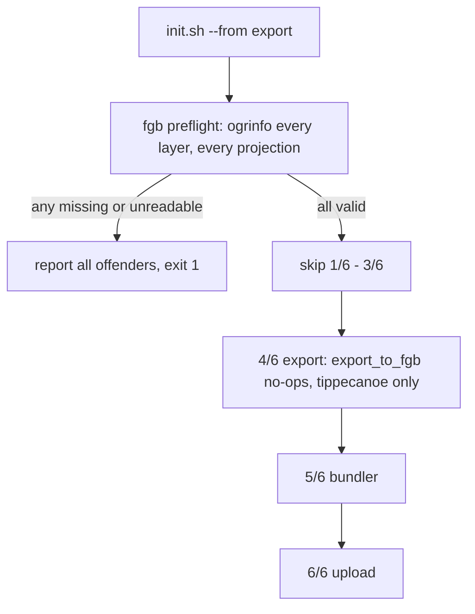

# Add `--from export` to init.sh

## What already works, and what doesn't

`abt export` is already per-layer resumable, so no Python change is needed for the tippecanoe half:

```23:32:abtv2-tools/abt/export/exporter.py
def export_to_fgb(layer: TileLayer) -> None:
    if not layer.ogr_export_filename.exists():
        run_subprocess(
            cmd=layer.ogr_cmd,
```

`export_to_mbtiles` likewise skips only layers whose output is a *complete* tileset, deleting and re-running tippecanoe on stubs left by an interrupted run.

The gap is entirely in [init.sh](init.sh): it unconditionally runs `[1/6] download`, `[2/6] import`, `[3/6] carto` before reaching `[4/6] export`. With the `.fgb` files already on disk those three stages are hours of wasted work, and `[4/6]` would then be pure tippecanoe.



## 1. New `--from <stage>` flag

Add to the arg loop alongside `--projections`/`--contours`, defaulting to `download`:

```bash
START_STAGE="download"
...
        --from)
            START_STAGE="$2"
            shift 2
            ;;
```

Validate next to the existing post-loop `PROJECTIONS` checks. Only two start points are accepted, since `export` is the only one whose inputs this plan knows how to verify:

```bash
case "$START_STAGE" in
    download|export) ;;
    *) echo "ERROR: --from must be 'download' (default) or 'export', got '$START_STAGE'" >&2; exit 1 ;;
esac
```

## 2. Fail-fast `.fgb` preflight

Place it immediately after the `--contours` verification block and, critically, **before** the Overture launch — otherwise a missing `.fgb` would abort only after a multi-hour background fetch had already started.

First the tool check, matching the style of the existing `duckdb`/`aws`/`sqlite3` guards:

```bash
if [[ "$START_STAGE" == export ]]; then
    command -v ogrinfo >/dev/null 2>&1 || { echo "ogrinfo is required for --from export but was not found on PATH" >&2; exit 1; }
fi
```

`ogrinfo` ships with the `gdal` dependency in [abtv2-tools/env.yaml](abtv2-tools/env.yaml), so it is present whenever the `abtv2` env this script already assumes is active.

Then the layer list. It must come from each JSON's `layer_id`, **not** the filename: six layers disagree (`adm0_labels.json` declares `adm0_label`, same for `adm1`/`adm2` labels and lines). The `*.json` glob also excludes `building_polygon.json.skip` exactly as `DataSchema.export_layers` does.

```bash
export_layer_ids() {
    python - "$SCHEMA/export" <<'PY'
import json, sys
from pathlib import Path
for path in sorted(Path(sys.argv[1]).glob("*.json")):
    print(json.loads(path.read_text())["layer_id"])
PY
}
```

Per-projection verification, reporting every offender rather than the first (same intent as `wait_jobs`). `.fgb` names carry no projection suffix, which is why each projection has its own `workspace_for` tree:

```bash
verify_fgb_for() {
    local srs="$1" fgb_dir layer_id fgb status=0
    fgb_dir="$(workspace_for "$srs")/flatgeobuf"
    for layer_id in "${EXPORT_LAYER_IDS[@]}"; do
        fgb="$fgb_dir/$layer_id.fgb"
        if [[ ! -f "$fgb" ]]; then
            echo "  MISSING:    $fgb" >&2
            status=1
        elif ! ogrinfo -so -al "$fgb" >/dev/null 2>&1; then
            echo "  UNREADABLE: $fgb" >&2
            status=1
        fi
    done
    ...
    return "$status"
}
```

`ogrinfo -so` is a header read for FlatGeobuf (envelope and feature count both live in the header), so this is cheap even at planet scale, and it catches the truncated-`.fgb` case that a bare existence test would hand straight to tippecanoe — the same validation the Overture recovery notes already prescribe.

Driver:

```bash
if [[ "$START_STAGE" == export ]]; then
    mapfile -t EXPORT_LAYER_IDS < <(export_layer_ids)
    [[ "${#EXPORT_LAYER_IDS[@]}" -gt 0 ]] || { echo "ERROR: no export layer JSONs found in $SCHEMA/export" >&2; exit 1; }
    status=0
    for srs in "${PROJECTIONS[@]}"; do
        verify_fgb_for "$srs" || status=1
    done
    [[ "$status" -eq 0 ]] || exit 1
fi
```

The empty-array guard doubles as the error path for a failed `python`: process substitution failures don't trip `set -e`, so `mapfile` would otherwise silently yield zero layers and vacuously "pass".

## 3. Gate stages [1/6]-[3/6]

```bash
if [[ "$START_STAGE" == download ]]; then
    echo "[1/6] download"
    ...
    echo "[3/6] carto"
    python "$ABT_TOOLS" carto -w "$WORKSPACE" -s "$SCHEMA" -p "$PROVIDER"
else
    echo "[1-3/6] skipped (--from export): reusing verified .fgb files"
fi
```

`[4/6]` onward is untouched. Because the preflight guarantees every `.fgb` exists, `export_to_fgb` no-ops for all layers and Postgres is never read — the stage becomes exactly the tippecanoe pass you asked for, still fanned out `$JOBS`-wide per projection.

## 4. Docs

- The `--from` entry in `init.sh`'s header comment block, next to `--projections`/`--contours`.
- The `init.sh` paragraph in [rbt-schema/README.md](rbt-schema/README.md) (~lines 475-500), which already documents `--overture`/`--projections`/`--contours`.

## Optional: don't re-tile Overture on a resume

Worth knowing before you run this, and easy to drop from the plan. [rbt-schema/scripts/overture/tile.sh](rbt-schema/scripts/overture/tile.sh) calls tippecanoe with `--force` and never checks for an existing output, so `--from export --overture` re-tiles buildings from scratch even when `building_polygon_<srs>.{mbtiles,btis}` is already sitting in `/rbt/overture`. And because `--overture` also controls the `-q` flag at `[5/6]`, dropping the flag to avoid that would also drop buildings from the bundle.

The fix mirrors the `.fgb` philosophy: skip *launching* the background pipeline when every `overture_for "$srs"` output already exists, while still passing `-q` at `[5/6]`.

## Verification

No shell test harness exists in this repo (`abtv2-tools/tests/` is all pytest), so this is manual:

- `./init.sh --from bogus` errors listing the valid values.
- Delete one `.fgb` from one projection's workspace: reports `MISSING`, exits 1, and `pgrep -af 'fetch.sh|shard.sh'` confirms no Overture job was launched.
- `truncate -s 100` a `.fgb`: reports `UNREADABLE`.
- Happy path on a scratch workspace: prints the per-projection all-clear and jumps straight to `[4/6]`; confirm the fgb log dir shows no `ogr2ogr` invocations.

## Note on implementation location

This keeps the whole change in `init.sh`, at the cost of restating two conventions Python already owns (`layer_id` -> `<layer_id>.fgb`, and the `flatgeobuf/` subdir). The alternative is a `--verify-fgb-only` flag on `abt export` that reuses `TileLayer.ogr_export_filename` and `DataSchema.export_layers` directly and is unit-testable; say the word if you'd rather have it there.