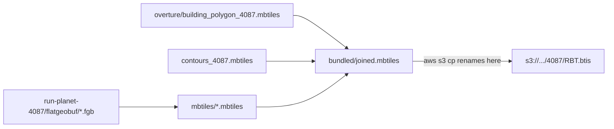

# All projections write `.mbtiles`; `.btis` survives only as the S3 key

## Scope

Four write-sites flip to `.mbtiles`. The S3 upload name is already what you want, and the BTIS metadata rows stay.

For 4087 the artifacts become:

- `/rbt/overture/building_polygon_4087.mbtiles` (was `.btis`)
- `/rbt/run-planet-4087/mbtiles/*.mbtiles` (was `*.btis`)
- `/rbt/run-planet-4087/bundled/joined.mbtiles` (was `joined.btis`)
- `s3://.../4087/RBT.btis` — unchanged, `upload_name_for` already returns this and `aws s3 cp` renames on upload



Decisions already made: clean break with no migration (pre-existing `.btis` artifacts get rebuilt), and the read-side `.btis` fallbacks stay.

## 1. Per-layer export output

[abtv2-tools/abt/export/tile_layer_model.py](abtv2-tools/abt/export/tile_layer_model.py) drops the branch entirely:

```python
    @property
    def mbtiles_export_filename(self) -> Path:
        return self.mbtiles_dir / f"{self.layer_id}.mbtiles"
```

`is_projection_override_active` stays — it still drives `geometry_column_sql`, the `-s EPSG:3857` flag in `tippecanoe_cmd`, and the `crs`/bounds/center metadata written by `export_to_mbtiles`.

## 2. Bundled output

In [abtv2-tools/abt/export/bundler.py](abtv2-tools/abt/export/bundler.py), delete the rename but keep the `crs` lookup, which the metadata block further down still needs:

```python
    crs = resolve_crs_from_files(bundle.tile_list)
```

That makes `package_name_explicit` dead — it exists only to gate this rename. Remove it from all three places: the field and its docstring entry in [abtv2-tools/abt/export/bundler_model.py](abtv2-tools/abt/export/bundler_model.py), and the `package_name_explicit=output_name is not None` kwarg in [abtv2-tools/abt/cli_funcs/bundler.py](abtv2-tools/abt/cli_funcs/bundler.py). `-o/--output-name` keeps working; it just stops being a special case.

## 3. Overture buildings

In [rbt-schema/scripts/overture/tile.sh](rbt-schema/scripts/overture/tile.sh) both branches now agree on the output name, so hoist it out of the `if` and keep only `PARTSDIR`/`PROJ_FLAG` inside:

```bash
OUT="$OUTDIR/building_polygon_$SRS.mbtiles"
```

Then `overture_for` in [init.sh](init.sh) collapses to one line:

```bash
overture_for() {
    echo "$OVERTURE_DIR/building_polygon_$1.mbtiles"
}
```

## 4. Read-side stays as-is

No changes to `Bundler.tile_list`, `vundler.resolve_input`, or `init.sh`'s `resolve_bundled`. All three already check `mbtiles` before `btis` and stop at the first hit, so a fresh `.mbtiles` shadows any stale `.btis` sitting beside it. The stale files just waste disk; clean them when convenient with `find /rbt/run-planet-* /rbt/overture -name '*.btis' -delete`.

## 5. Help text and docs

- [abtv2-tools/abt/utils/fields.py](abtv2-tools/abt/utils/fields.py): drop the ".btis extension instead of .mbtiles" clause from `projection_override_field` (keep the spec-non-conformance warning and the metadata-rows sentence), and the `joined.btis`/`.btis` mentions in `output_name_field` and `vundler_input_field`.
- `output_name` docstring in [abtv2-tools/abt/cli_funcs/bundler.py](abtv2-tools/abt/cli_funcs/bundler.py).
- [abtv2-tools/README.md](abtv2-tools/README.md) (5 mentions: export, bundler, vundler, and the Reuse section).
- [rbt-schema/scripts/overture/README.md](rbt-schema/scripts/overture/README.md) (3 mentions, including the `tag_crs.py` re-tag example).
- [rbt-schema/README.md](rbt-schema/README.md) and the `.btis`-convention comments in [init.sh](init.sh) (the `workspace_for` block and the `[5/6]` extension note, which no longer needs to warn about extensions differing per projection).

## 6. Tests

- [abtv2-tools/tests/test_export_tile_layer_model.py](abtv2-tools/tests/test_export_tile_layer_model.py): `test_mbtiles_export_filename_uses_btis_extension_under_override` now asserts the opposite — rename it and assert `.mbtiles` under `projection_override="EPSG:3395"`.
- Add a test in [abtv2-tools/tests/test_export_bundler_trim.py](abtv2-tools/tests/test_export_bundler_trim.py) (or a new `test_export_bundler.py`) covering the behavior change that currently has no test at all: a CRS-tagged input must yield `joined.mbtiles`, not `joined.btis`.
- Leave the `.btis` fallback tests in `test_export_bundler_model.py` and `test_cli_funcs_vundler.py` alone; they cover the retained read path.
- `test_export_bundler_trim.py`'s existing `export_bundled` tests use untagged inputs, so removing the rename doesn't affect them.

## Verification

- `pytest` in `abtv2-tools/`
- `bash -n init.sh rbt-schema/scripts/overture/tile.sh`
- `rg -n 'btis' --glob '!.cursor/**'` and confirm every remaining hit is either a read-side fallback, a metadata/BTIS-spec reference, or `upload_name_for`

## What to expect on the next run

Because the skip-checks now look for `.mbtiles`, anything previously built as `.btis` is treated as absent and rebuilt:

- `[4/6]` re-runs tippecanoe for all 58 layers in each non-3857 workspace (the `.fgb` files are untouched, so `ogr2ogr` still no-ops and `--from export` still works).
- `overture_already_tiled` won't match the old `building_polygon_4087.btis`, so `--overture` re-runs the pipeline. `fetch.sh`/`shard.sh` skip shards that already exist, so this is a tippecanoe re-tile rather than a re-shard — unless you'd previously used `--overture-clean`, in which case the shards are gone and it re-shards too.