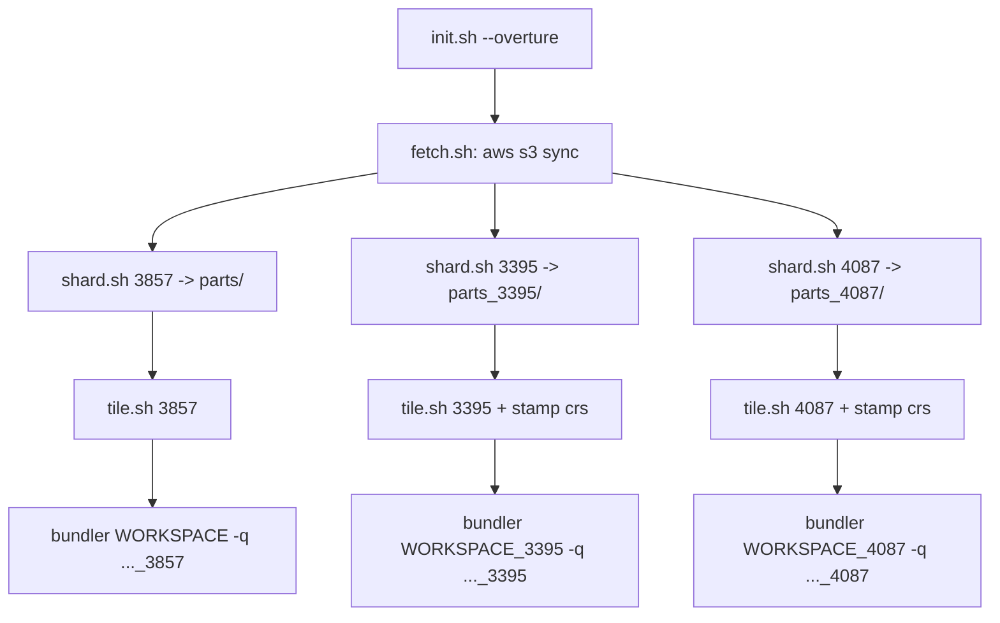

# Overture EPSG:4087 support and an `--overture` flag for `init.sh`

## Goal

Three changes, in dependency order:

1. Teach `rbt-schema/scripts/overture/` to produce `building_polygon_4087.mbtiles` alongside the existing 3857 and 3395 outputs.
2. Add `--overture` to [init.sh](init.sh), running the pipeline in the background alongside the multi-hour Postgres stages.
3. Auto-pass each projection's Overture mbtiles to its matching bundler via `-q/--additional-mbtiles`.

## The one real landmine: `crs` metadata

`tile.sh` output is raw tippecanoe, which writes no `crs` metadata row. The `export` stage, by contrast, stamps one on every non-3857 layer ([exporter.py](abtv2-tools/abt/export/exporter.py) lines 40-52). The bundler refuses to join files that disagree:

```66:82:abtv2-tools/abt/export/mbtiles_metadata.py
def resolve_crs_from_files(paths: List[Path]) -> Optional[str]:
    crs_by_file = {p.name: read_mbtiles_crs(p) for p in paths}
    distinct = set(crs_by_file.values())
    if len(distinct) > 1:
        ...
        raise ValueError(f"Files were built with different projections: {details}")
```

So passing today's `building_polygon_3395.mbtiles` to the 3395 bundler would raise `ValueError` on `{EPSG:3395, None}`. Fix: `tile.sh` stamps `crs` into non-3857 outputs. Only `crs` is needed, not `bounds`/`center` — [bundler.py](abtv2-tools/abt/export/bundler.py) recomputes those on the joined output from `crs_area_of_use_bounds(epsg)`, and `bounds`/`center` are in `TOOL_COMPUTED_METADATA_KEYS` anyway.

`sqlite3` is already installed by [setup_ubuntu.sh](setup_ubuntu.sh) (line 315), so the script stays standalone rather than importing `abtv2-tools` Python.

## Flow



## 1. `shard.sh` — add 4087, unify the SRS vocabulary

Today `TARGET_SRS` is `4326|3395` (input space) while `tile.sh`'s arg is `3857|3395` (output space). Two vocabularies for the same three cases is the main thing that makes this script easy to misuse. Unify on **output projection** (`3857|3395|4087`) and map internally:

```bash
case "${TARGET_SRS:-3857}" in
  3857)      geom_expr="geometry";                                            out_srs="EPSG:4326" ;;
  3395|4087) geom_expr="ST_Transform(geometry, 'EPSG:4326', 'EPSG:${TARGET_SRS}')"; out_srs="EPSG:3857" ;;
  *) echo "ERROR: TARGET_SRS must be 3857, 3395, or 4087" >&2; exit 1 ;;
esac
```

The `out_srs="EPSG:3857"` lie for the reprojected cases is the same trick the main export path uses (`ST_Transform(geometry, <code>)` then `-s EPSG:3857`, [tile_layer_model.py](abtv2-tools/abt/export/tile_layer_model.py) lines 244-245 and 311) — so the Overture tiles land on the exact same grid as the sibling RBT layers they get joined with. That is what makes the join geographically valid.

Note this is a small breaking change to the env contract (`TARGET_SRS=4326` becomes `3857`); the only caller is the README recipe, updated below. The `*)` branch is new — today a typo silently falls through to the untransformed path.

`ST_Area_Spheroid` stays on the source WGS84 geometry, so `area` (and therefore the zoom filter) is identical across all three variants.

## 2. `tile.sh` — add 4087, stamp `crs`

Replace the `if 3395` block with a case over `3857|3395|4087`, deriving both paths from `$SRS`:

```bash
case "$SRS" in
  3857)      PARTSDIR="$OUTDIR/parts";        PROJ_FLAG=() ;;
  3395|4087) PARTSDIR="$OUTDIR/parts_$SRS";   PROJ_FLAG=(--projection=EPSG:3857) ;;
  *) echo "ERROR: srs must be 3857, 3395, or 4087" >&2; exit 1 ;;
esac
OUT="$OUTDIR/building_polygon_${SRS}.mbtiles"
```

Then after tippecanoe, for the non-3857 cases:

```bash
if [[ "$SRS" != "3857" ]]; then
  sqlite3 "$OUT" "INSERT OR REPLACE INTO metadata (name, value) VALUES ('crs', 'EPSG:${SRS}');"
fi
```

`INSERT OR REPLACE` matches `write_mbtiles_metadata` and relies on the unique index tippecanoe already creates on `metadata(name)`.

Output filenames keep the `.mbtiles` extension even for 3395/4087, as requested. Worth knowing: this diverges from the BTIS convention the rest of the repo follows, where non-3857 output is named `.btis`. It's harmless — `additional_mbtiles` paths are taken literally by `Bundler.tile_list` — but it means these files are named `.mbtiles` while carrying a non-spec `crs` row.

## 3. `fetch.sh` — `sync`, multi-SRS shard, release guard

- `aws s3 cp --recursive` becomes `aws s3 sync` so re-runs skip completed downloads, matching `shard.sh`'s existing idempotent-restart design.
- Add `SRS_LIST` (default `3857`) and loop the shard step, one `parts` dir per projection:

```bash
for srs in ${SRS_LIST:-3857}; do
  partsdir="$OUTDIR/parts"; [[ "$srs" == "3857" ]] || partsdir="$OUTDIR/parts_$srs"
  mkdir -p "$partsdir"
  ls "$OUTDIR"/overture-buildings/*.parquet \
    | TARGET_SRS="$srs" xargs -P "$JOBS" -n 1 bash shard.sh "$partsdir"
done
```

- Release guard: `sync` into a directory holding a different Overture release would silently mix two releases. If `$OUTDIR/RELEASE` exists and differs from the discovered release, abort with a message telling the operator to clear the dir. Add an optional `OVERTURE_RELEASE` env to pin a release explicitly instead of always taking the newest.

## 4. `init.sh` — the `--overture` flag

[init.sh](init.sh) has no argument parsing today, so add a small loop before the config block:

```bash
RUN_OVERTURE=false
while [[ $# -gt 0 ]]; do
  case "$1" in
    --overture) RUN_OVERTURE=true; shift ;;
    *) echo "unknown option: $1" >&2; exit 1 ;;
  esac
done
```

New config vars alongside the existing ones: `OVERTURE_DIR="/rbt/overture"` and `OVERTURE_SCRIPTS="$SCHEMA/scripts/overture"`.

**Preflight.** In the same spirit as the existing fail-fast AWS credential checks (lines 30-39), verify `duckdb` and `sqlite3` are on `PATH` when `--overture` is set, and fail immediately rather than hours in. Flagging: `setup_ubuntu.sh` installs `sqlite3` but **not** `duckdb` or the AWS CLI — the Overture pipeline's dependencies have never been provisioned by it, because until now it was documented as a manual, standalone thing. This preflight turns that into a clear error; actually adding `duckdb` to `setup_ubuntu.sh` is a reasonable follow-up but is out of scope unless you want it included.

**Background launch**, right after `wait_jobs()` is defined and before `[1/6]`:

```bash
if [[ "$RUN_OVERTURE" == true ]]; then
    echo "[overture] starting in background (log: $OVERTURE_DIR/overture.log)"
    mkdir -p "$OVERTURE_DIR"
    (
        SRS_LIST="3857 3395 4087" bash "$OVERTURE_SCRIPTS/fetch.sh" "$OVERTURE_DIR" "$JOBS"
        for srs in 3857 3395 4087; do
            bash "$OVERTURE_SCRIPTS/tile.sh" "$OVERTURE_DIR" "$srs"
        done
    ) > "$OVERTURE_DIR/overture.log" 2>&1 &
    pid_overture=$!
fi
```

Output is redirected to a log because sharding emits one `done`/`skip` line per parquet file and would otherwise bury the `[n/6]` progress markers. It's joined with the existing `wait_jobs` helper just before `[5/6]`, so a failed Overture run aborts the script before bundling rather than producing a bundle silently missing buildings.

**Bundler wiring.** Build a per-projection flag array and expand it into each existing invocation:

```bash
q_3857=(); q_3395=(); q_4087=()
if [[ "$RUN_OVERTURE" == true ]]; then
    q_3857=(-q "$OVERTURE_DIR/building_polygon_3857.mbtiles")
    q_3395=(-q "$OVERTURE_DIR/building_polygon_3395.mbtiles")
    q_4087=(-q "$OVERTURE_DIR/building_polygon_4087.mbtiles")
fi
python "$ABT_TOOLS" bundler -w "$WORKSPACE" -s "$SCHEMA" -p "$PROVIDER" "${q_3857[@]}" &
```

Empty-array expansion under `set -u` is safe on bash 4.4+; `init.sh` already targets the Ubuntu box, so this is fine there but would break under macOS's bash 3.2.

## 5. Docs

- [rbt-schema/scripts/overture/README.md](rbt-schema/scripts/overture/README.md): rewrite around the unified `3857|3395|4087` vocabulary and `SRS_LIST`, and note the `crs` stamping.
- [rbt-schema/README.md](rbt-schema/README.md) section "`scripts/overture/` — standalone Overture buildings pipeline" (line 444): it currently states the pipeline "isn't invoked by `abt-tools.py` at all" and must be folded in manually. Still true of `abt-tools.py`, but `init.sh --overture` now automates it — update that paragraph and the mermaid diagram edge at line 65.

## Notes and risks

- **Disk.** Three `parts` dirs means three full FlatGeobuf copies of planet building footprints. This is by far the biggest practical cost of the change, and neither `tile.sh` nor `init.sh` cleans them up. Say the word if you want an opt-in cleanup step after each `tile.sh`.
- **CPU contention.** The background Overture job fans out `$JOBS` shard workers on top of the existing stages, and `[4/6]` already runs up to 3x `$JOBS` (see the note at lines 88-98). Consider a smaller job count for the Overture pass.
- **EPSG:4087 is a legitimate target for this trick.** It's metre-based (World Equidistant Cylindrical), satisfying the constraint documented on `--projection-override` in [fields.py](abtv2-tools/abt/utils/fields.py) lines 171-190. Its x extent matches Web Mercator's while its y extent is half, so tiles occupy the middle band of the tippecanoe square with empty top and bottom — the same benign consequence the existing 4087 workspace already lives with.
