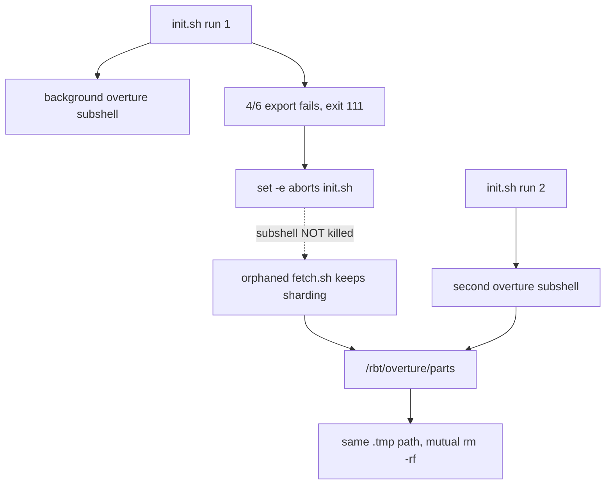

« # Fix Overture pipeline concurrency corruption

## Root cause recap

Two `fetch.sh` passes ran against `/rbt/overture` at once. `shard.sh` derives its temp path from the input filename alone, so both workers on the same parquet file used the identical `.part-XXXXX.tmp` path and each one's `rm -rf "$tmp"` destroyed the other's in-progress output. Failing workers made `xargs` exit 123, which `set -euo pipefail` turned into a `fetch.sh` abort at the end of the first (3857) pass, so 3395 and 4087 never ran and no `tile.sh` ever executed.

The second writer came from `init.sh` launching the Overture pipeline with `&` and never killing it, so the earlier run's failure at `[4/6] export` orphaned a still-sharding subshell.



Three layers of fix: prevent the orphan, refuse the overlap, and make the temp paths collision-proof even if both slip through.

## 1. Per-process temp paths in shard.sh

[rbt-schema/scripts/overture/shard.sh](rbt-schema/scripts/overture/shard.sh) currently uses a path derived only from the input name:

```bash
tmp="${partsdir}/.${name}.tmp"
```

Add `$$` so concurrent workers can never target the same path, and register an `EXIT` trap so a failed or interrupted worker cleans up after itself instead of leaving debris:

```bash
tmp="${partsdir}/.${name}.$$.tmp"
# ... after the `-s "$out"` skip check:
trap 'rm -rf "$tmp"' EXIT
```

Keep the existing `rm -rf "$tmp"` before the DuckDB `COPY`: PIDs get reused across runs, so a same-named leftover is still possible.

Note the `[[ -s "$out" ]]` skip test does not need strengthening. `$out` only ever appears via `mv` of a completed temp, so it is trustworthy once concurrent `rm -rf` is impossible; the truncated-shard risk was purely a symptom of the race.

## 2. New shared lock helper

Add `rbt-schema/scripts/overture/lock.sh`, sourced by both `fetch.sh` and `tile.sh` (both already `cd "$(dirname "$0")"`). It exposes one function taking the data dir and a mode:

- Opens the lock file with `exec 9<>"$OUTDIR/.lock"` — read-write **without** truncation, so a failed acquire can still read the holder's PID for the error message (`exec 9>` would truncate it away before we could report it).
- `flock -n -x 9` for exclusive, `flock -n -s 9` for shared. Fail-fast, no waiting, as chosen.
- On failure: print the holding PID from the lock file and exit 1 with a message saying concurrent runs corrupt the parts dir.
- On success: `truncate -s 0` the file and write `$$` into fd 9.

The kernel releases the lock when the process dies, including on `SIGKILL`, so there is no stale-lock cleanup and no pidfile to go bad.

## 3. Exclusive lock in fetch.sh, shared lock in tile.sh

[rbt-schema/scripts/overture/fetch.sh](rbt-schema/scripts/overture/fetch.sh) takes the **exclusive** lock right after its `mkdir -p "$OUTDIR"`, before the release check and `aws s3 sync`. It is the only writer to the shared parts dirs.

[rbt-schema/scripts/overture/tile.sh](rbt-schema/scripts/overture/tile.sh) takes a **shared** lock. Two `tile.sh` runs for different projections were always safe (separate `PARTSDIR`/`OUT`, and tippecanoe `mkstemp`s inside the shared `tippe_temp`), and the README documents running them that way, so a shared lock preserves that while still blocking any overlap with `fetch.sh`.

Also in `fetch.sh`, sweep stale temps at the start of each pass, which is only safe because the exclusive lock is held:

```bash
find "$partsdir" -maxdepth 1 -name '.*.tmp' -exec rm -rf {} +
```

Using `find` rather than a `rm -rf "$partsdir"/.*.tmp` glob so the no-match case is clean.

## 4. init.sh: kill the background job instead of orphaning it

[init.sh](init.sh) has no `trap` at all today. Two changes around the launch at lines 226-231:

Enable job control just for the launch so the subshell gets its own process group. This is the load-bearing detail: `kill "$pid_overture"` alone would only kill the subshell and leave `xargs` plus its 128 `shard.sh`/`duckdb` children running, which is exactly the orphan we are trying to prevent.

```bash
set -m                    # own process group, so the trap can signal the whole tree
(
    SRS_LIST="${PROJECTIONS[*]}" bash "$OVERTURE_SCRIPTS/fetch.sh" "$OVERTURE_DIR" "$JOBS"
    ...
) > "$OVERTURE_DIR/overture.log" 2>&1 &
pid_overture=$!
set +m
```

Then a cleanup handler registered on `EXIT INT TERM` that signals the process group (`kill -TERM -- -"$pid_overture"`), falling back to the bare PID, and `wait`s. Guarded with `kill -0` and `${pid_overture:-}` so it is a no-op on the success path (the job is already reaped by `wait_jobs`) and when `--overture` was never passed.

The per-stage background jobs in `[4/6]`/`[5/6]`/`[6/6]` do not need this: `wait_jobs` already joins every one of them on both the success and failure paths. Only the Overture job spans stages. If you want the trap to cover Ctrl-C during those stages too, that is a small extension we can add.

## 5. init.sh: `--overture` accepts an optional projection list

Make `--overture "3857 4087"` work as shorthand for `--overture --projections "3857 4087"`. Consume the next argument only when it does not look like a flag, so bare `--overture --contours ...` still parses:

```bash
--overture)
    RUN_OVERTURE=true
    if [[ $# -ge 2 && "${2-}" != --* ]]; then
        read -r -a PROJECTIONS <<< "$2"
        shift 2
    else
        shift
    fi
    ;;
```

`${2-}` rather than `$2` so `set -u` is safe regardless of short-circuit order. Apply the same to `--overture-clean`, which also implies `--overture` and would otherwise still reject a list confusingly.

No validation changes needed: the existing post-loop empty-array and `^[0-9]+$` checks already cover whichever path set `PROJECTIONS`.

## 6. Docs

Update [rbt-schema/scripts/overture/README.md](rbt-schema/scripts/overture/README.md):

- Document the `$OUTDIR/.lock` file, the exclusive/shared split, and the fail-fast error.
- Add a short recovery section for an interrupted run: check for orphans with `pgrep -af 'fetch.sh|shard.sh|duckdb'`, sweep `.*.tmp`, and re-run. The existing claim that the pipeline "is safe to re-run after an interruption" now actually holds.
- Note the `--overture "<list>"` shorthand.

Also update the `--overture` description in `init.sh`'s header comment block.

## 7. One-time recovery on the current box

Not a code change, but needed before the next run, since existing shards may have been corrupted by the race:

```bash
pgrep -af 'fetch.sh|shard.sh|duckdb'      # kill any orphan first
find /rbt/overture/parts* -maxdepth 1 -name '.*.tmp' -exec rm -rf {} +
for f in /rbt/overture/parts/*.fgb; do
  ogrinfo -so -al "$f" >/dev/null 2>&1 || echo "BAD $f"
done                                       # delete any BAD, then re-run
```

`ogrinfo` comes from the `abtv2` micromamba env; prefix with `micromamba run -n abtv2` if it is not on `PATH`.

## Verification

There is no shell test harness in this repo (`abtv2-tools/tests/` is all pytest), so verification is manual:

- Lock: hold it manually with `bash -c 'exec 9<>/tmp/ovt/.lock; flock -x 9; sleep 60' &`, then run `fetch.sh /tmp/ovt` and confirm it refuses with the holder PID and exits 1.
- Shared lock: two concurrent `tile.sh` runs for different projections should both proceed.
- Arg parsing: `--overture "3857 4087"`, `--overture`, `--overture --contours /x`, and `--overture-clean "4087"` should all parse; a non-numeric entry should still be rejected.
- Trap: with a scratch data dir, start `init.sh --overture` and interrupt it during `[4/6]`, then confirm `pgrep -af 'shard.sh|duckdb'` is empty afterwards. »