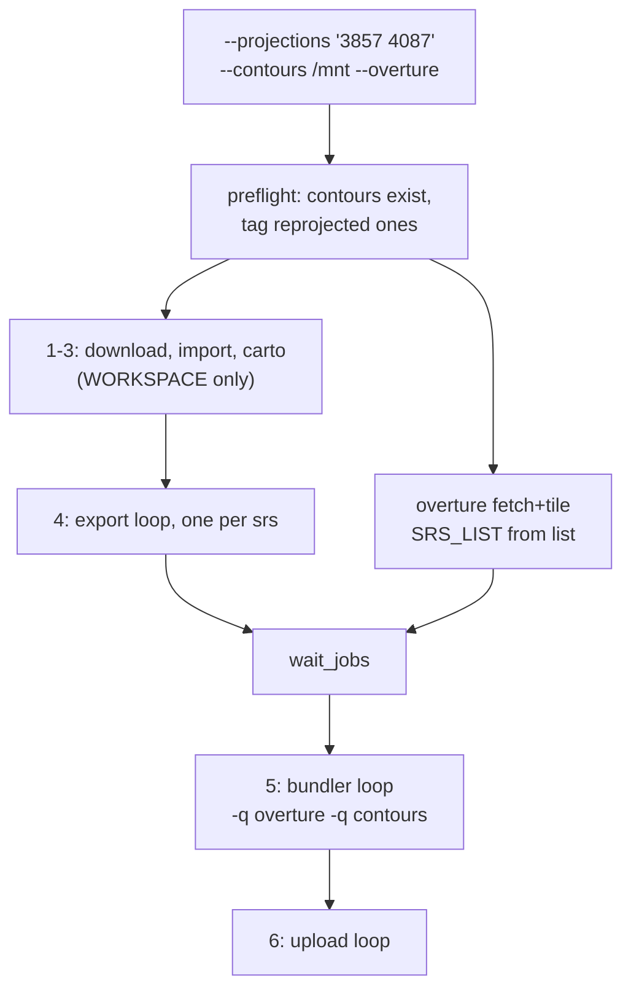

# Parameterized projections and contours for `init.sh`

## Target invocation

```bash
./init.sh --projections "3857 4087" --contours /mnt --overture
```

Default `--projections` stays `"3857 3395 4087"`, so an existing bare `./init.sh` behaves exactly as it does today.

## Why this is a refactor, not a flag

[init.sh](init.sh) hardcodes every projection three times over: `WORKSPACE_3395`/`WORKSPACE_4087`, `PROJECTION_3395`/`PROJECTION_4087`, `S3_BUCKET_3857`/`S3_BUCKET_3395`, `q_3857`/`q_3395`/`q_4087`, plus explicit per-projection invocations and `pid_*` variables in `[4/6]`, `[5/6]`, and `[6/6]`. Supporting an arbitrary list means converting all of it to loops.

The good news: every per-projection value derives by convention from the SRS code with a single 3857-vs-reprojected split, and the existing `wait_jobs` helper already takes `"label:pid"` strings, so it drops straight into a loop.

## The blocker: CRS tagging for reprojected contours

`/mnt/contours_4087.mbtiles` has no `crs` row, so the 4087 bundle would fail with `ValueError: Files were built with different projections` — its own layers and the Overture output both read `EPSG:4087`, the contours read `None`. Fix with the existing generic tagger:

```bash
python3 rbt-schema/scripts/overture/tag_crs.py 4087 /mnt/contours_4087.mbtiles
```

Note this **mutates the file in `/mnt`**. It is idempotent (`tag_crs.py` does `DELETE` then `INSERT`) and the tag is simply correct metadata, but if `/mnt` is read-only or shared with other consumers, copy the file first instead. The 3857 contours must be left untagged — a `crs` row there would break the 3857 bundle the same way.

## Derived-by-convention values

For each `$srs` in the list:

- Workspace: `3857` uses `$WORKSPACE` (`/rbt/run-planet`), others `$WORKSPACE-$srs`. The 3857 path stays unsuffixed so the already-populated workspace on the box remains valid.
- Export flag: `3857` gets none, others `--projection-override EPSG:$srs`.
- Overture input: `building_polygon_3857.mbtiles` vs `building_polygon_$srs.btis` (see the extension note already in `[5/6]`).
- Contours input: `$CONTOURS_DIR/contours_$srs.mbtiles`.
- Upload target: `$S3_BUCKET_PREFIX/$srs/RBT.mbtiles` for 3857, `RBT.btis` otherwise.

`$WORKSPACE` stays defined independently of the list because `[1/6]`-`[3/6]` (download/import/carto) are projection-independent and always run there — so `--projections "4087"` alone still works.

`S3_BUCKET_3857`/`S3_BUCKET_3395` collapse into one `S3_BUCKET_PREFIX="s3://data-478728046499-us-east-1-an"`; both current values already match `<prefix>/<srs>/`, so nothing changes for them.

## Flow



## Changes to [init.sh](init.sh)

**Arg parsing.** Add to the existing `while`/`case`:

```bash
--projections)
    read -r -a PROJECTIONS <<< "$2"
    shift 2
    ;;
--contours)
    CONTOURS_DIR="$2"
    shift 2
    ;;
```

Then validate the list is non-empty and every entry is numeric, mirroring the guards added to `shard.sh`/`tile.sh`.

**Helpers**, next to `wait_jobs`/`resolve_bundled`:

```bash
workspace_for()   { if [[ "$1" == 3857 ]]; then echo "$WORKSPACE"; else echo "$WORKSPACE-$1"; fi; }
overture_for()    { if [[ "$1" == 3857 ]]; then echo "$OVERTURE_DIR/building_polygon_3857.mbtiles"
                    else echo "$OVERTURE_DIR/building_polygon_$1.btis"; fi; }
contours_for()    { echo "$CONTOURS_DIR/contours_$1.mbtiles"; }
upload_name_for() { if [[ "$1" == 3857 ]]; then echo "RBT.mbtiles"; else echo "RBT.btis"; fi; }
```

**Contours preflight**, alongside the existing AWS-credential and duckdb checks. This is the step that turns an hours-in bundler crash into an immediate error:

```bash
if [[ -n "$CONTOURS_DIR" ]]; then
    command -v sqlite3 >/dev/null 2>&1 || { echo "sqlite3 is required for --contours" >&2; exit 1; }
    for srs in "${PROJECTIONS[@]}"; do
        f="$(contours_for "$srs")"
        # Bundler.tile_list silently drops a -q path that doesn't exist, so a
        # typo'd --contours dir would otherwise ship a bundle with no contours.
        if [[ ! -f "$f" ]]; then echo "ERROR: no contours file at $f" >&2; exit 1; fi
        current="$(sqlite3 "$f" "SELECT value FROM metadata WHERE name='crs';")"
        if [[ "$srs" == 3857 && -n "$current" ]]; then
            echo "ERROR: $f claims $current but 3857 inputs must carry no crs row" >&2; exit 1
        elif [[ "$srs" != 3857 && -z "$current" ]]; then
            "${PYTHON:-python3}" "$OVERTURE_SCRIPTS/tag_crs.py" "$srs" "$f"
        elif [[ "$srs" != 3857 && "$current" != "EPSG:$srs" ]]; then
            echo "ERROR: $f claims $current, cannot bundle as EPSG:$srs" >&2; exit 1
        fi
    done
fi
```

**Stages `[4/6]`, `[5/6]`, `[6/6]`** each become one loop accumulating `"$srs:$!"` into a `pids` array, then `wait_jobs "${pids[@]}"`. The bundler loop builds its own `-q` list:

```bash
for srs in "${PROJECTIONS[@]}"; do
    q=()
    if [[ "$RUN_OVERTURE" == true ]]; then q+=(-q "$(overture_for "$srs")"); fi
    if [[ -n "$CONTOURS_DIR" ]]; then q+=(-q "$(contours_for "$srs")"); fi
    python "$ABT_TOOLS" bundler -w "$(workspace_for "$srs")" -s "$SCHEMA" -p "$PROVIDER" "${q[@]}" &
    pids+=("$srs:$!")
done
```

Use `if` blocks rather than `[[ ... ]] && q+=(...)` — under `set -e` a false test as the last command in a loop body would abort the script.

**Overture block**: `SRS_LIST="${PROJECTIONS[*]}"` and loop `tile.sh` over `"${PROJECTIONS[@]}"` instead of the literal `3857 3395 4087`.

**Comment fix**: `resolve_bundled`'s docstring says "which the 3395 workspace always will" — make it projection-generic.

## Behavior changes to be aware of

- **4087 now uploads.** Today `[6/6]` uploads only 3857 and 3395; a generic loop uploads every listed projection, so 4087 lands at `s3://.../4087/RBT.btis`. S3 creates the prefix on first put. Say the word if you'd rather I add `--no-upload` or keep an explicit upload subset.
- **4087 is named `RBT.btis`, not `RBT.mbtiles`**, following the existing 3395 convention for non-web-mercator output. Easy to change if you want the `.mbtiles` name.
- Contours filenames must match `contours_<srs>.mbtiles` inside `--contours`; your `/mnt/contours_3857.mbtiles` and `/mnt/contours_4087.mbtiles` already do.

## Docs

Update the `init.sh --overture` references I added in [rbt-schema/README.md](rbt-schema/README.md) and [rbt-schema/scripts/overture/README.md](rbt-schema/scripts/overture/README.md) to mention `--projections` and `--contours`.

## Verification

`bash -n`, then exercise the arg parser and helper derivations in isolation (as done for `--overture`), plus a contours-preflight test using small synthetic mbtiles: untagged 4087 gets tagged, mis-tagged aborts, missing file aborts, and a stray `crs` row on the 3857 file aborts.
