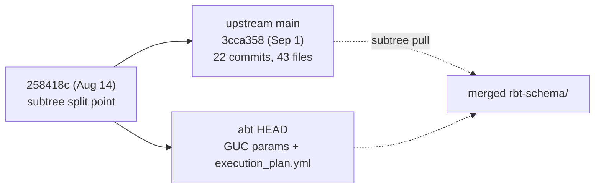

# Sync `rbt-schema/` subtree with upstream

## Current state

`rbt-schema/` was merged into abt as a git subtree (commit `647cae8`, `git-subtree-split: 258418c`, Aug 14). Both sides have moved since.



- Upstream ahead: 22 commits, +1282/-362 across 43 files.
- abt ahead: session-tuning GUCs in 4 SQL files, `.gitignore`, a rewritten `README.md`, and a new `carto_sql/execution_plan.yml` (never existed upstream).
- `import/` is untouched on both sides.

## Upstream changes to bring in

- **`name`/`name_en` consolidation** into a single English-first `name` field: `COALESCE(NULLIF(name_en, ''), NULLIF(name, ''))`. Touches `003_road.sql`, `004_railway.sql`, `009_land_cover.sql`, `022_dam.sql`, `026_places.sql`, and ~10 more, plus the matching field removals in `export/*.json`.
- **`005a_water_polygon.sql` rewrite** (886 lines) fixing simplification artifacts at small scales, restoring `export.ocean_polygon` logic, and splitting one sharded dissolve into six staged ones (`wsurf`, `wintw`, `wpair`, `wclus`, `wmerge`, `wpoly`).
- **NGA admin/place work** in `027_admin.sql` (+343): new `aux_data.nga_country_abbrev` table, `export.fmt_country_abbrev()`, `adm0_line_supplements` orphan check downgraded from `EXCEPTION` to `WARNING`; plus `place_labels` ranking tweaks and `status_cd` type fixes in `adm0/1/2` exports.
- **dblink port fix** (`d0df5d6`): `port=%s` / `current_setting('port')` in `005a` and `009`.
- **Overture alt-projection support**: new standalone [rbt-schema/scripts/overture/tag_crs.py](rbt-schema/scripts/overture/tag_crs.py), `.btis` extension for non-3857 output in `tile.sh`, and `shard.sh` / `README.md` updates.
- **Refreshed** `static_data/ne_physical_centerlines.fgb.zip` (new Appalachian/Rocky Mts geometries).

## Steps

### 1. Add remote and pull the subtree

```
git remote add rbt-schema git@github.com:ReleasableBasemapTiles/rbt-schema.git
git fetch rbt-schema
git checkout -b sync/rbt-schema-2026-09
git subtree pull --prefix=rbt-schema rbt-schema main
```

Note the org spelling differs from abt's own remote: upstream is `ReleasableBasemapTiles`, abt is `ReleaseableBasemapTiles`. No `--squash` — the original merge was unsquashed, so history stays linkable.

### 2. Resolve conflicts

- **[rbt-schema/carto_sql/009_land_cover.sql](rbt-schema/carto_sql/009_land_cover.sql)** — genuine same-line conflict. Upstream adds `port=%s` + `current_setting('port')` to `connstr`; abt parameterizes `max_parallel_workers_per_gather=%s`. Keep both:

```sql
nshards          CONSTANT int  := COALESCE(current_setting('abt.dissolve_shards', true)::int, 16);
parallel_workers CONSTANT int  := COALESCE(current_setting('abt.parallel_workers_per_gather', true)::int, 10);
cell             CONSTANT int  := 100000;
connstr          CONSTANT text := format(
    'dbname=%s port=%s options=''-c work_mem=2GB -c maintenance_work_mem=16GB -c max_parallel_workers_per_gather=%s -c parallel_setup_cost=100 -c parallel_tuple_cost=0.01 -c synchronous_commit=off -c jit=off''',
    current_database(), current_setting('port'), parallel_workers);
```

- **[rbt-schema/carto_sql/005a_water_polygon.sql](rbt-schema/carto_sql/005a_water_polygon.sql)** — take upstream's rewrite wholesale, then re-apply abt's changes on top (see step 3).
- **`003_road.sql`, `022_dam.sql`, `.gitignore`, `README.md`** — abt's edits are in hunks upstream never touched, so these should auto-merge. Verify the session-tuning header survives in the two SQL files.

### 3. Re-apply concurrency GUCs to the rewritten `005a`

Upstream's rewrite reverted the session header and now has **six** `nshards CONSTANT int := 16` blocks (was one). Left as-is, a concurrent carto run scales its GUCs down but the SQL ignores them and oversubscribes Postgres six ways.

- Restore the header: replace `SET max_parallel_workers_per_gather = 10;` with the `set_config(... COALESCE(current_setting('abt.parallel_workers_per_gather', true), '10') ...)` form, keeping abt's explanatory comment block.
- In each of the six blocks, change `nshards CONSTANT int := 16;` to `COALESCE(current_setting('abt.dissolve_shards', true)::int, 16)`, preserving upstream's new `port=%s` in every `connstr`.

The GUC names are set by [abtv2-tools/abt/carto_processing_model.py](abtv2-tools/abt/carto_processing_model.py) (`-c abt.dissolve_shards=... -c abt.parallel_workers_per_gather=...`), so they must match exactly.

### 4. Re-verify `execution_plan.yml`

[rbt-schema/carto_sql/execution_plan.yml](rbt-schema/carto_sql/execution_plan.yml) documents itself as accurate "as of rbt-schema commit 258418c" and asks to be re-verified on any script change. Checks already done:

- No `carto_sql/*.sql` files added or removed upstream, so the drift check in `carto_processing_model.py` will still pass and group membership stays valid.
- `water.classify_water_type()` still lives in `005a` and is still read by `005b`, so the `[005a, 005b]` sequential pairing holds.
- `water.water_surface_clean` disappeared in the rewrite but has no readers anywhere in `carto_sql/`.
- `005a`'s schema surface is otherwise unchanged (`water` schema, same `export.*` views), and `027_admin.sql`'s new `aux_data.nga_country_abbrev` sits in an existing schema.

Action is limited to updating the "as of commit" reference to the new upstream HEAD and re-reading `005a`/`027` for any new cross-script table reads.

### 5. Verify

- `cd abtv2-tools && python -m pytest` — covers the carto plan drift check and the bundler/tile-layer models.
- Confirm no `name_en` references remain outside `rbt-schema/` (currently none) and that `export/*.json` and the SQL agree on field names.
- Sanity-check `git diff 258418c..HEAD -- rbt-schema/` for anything that silently dropped abt's local work.

## Out of scope, worth flagging

The `name`/`name_en` consolidation is a breaking tile-schema change. Style definitions in the sibling `~/github/RBT/styles` repo that reference `name_en` will need a matching update, but that is a separate repo.
