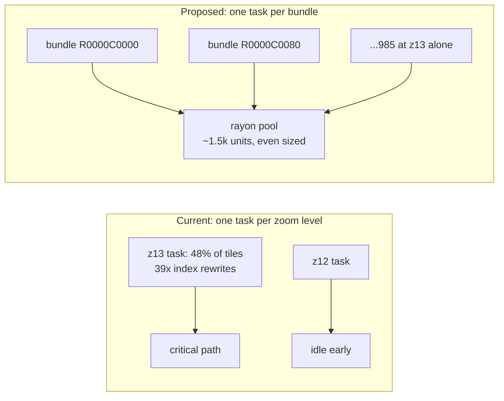

# Rust vundler with per-bundle parallelism

## What is actually slow (measured, not assumed)

Measured against `landcover_labels.mbtiles` (223 MB, z4-z13, 499,849 tiles) and `airports.mbtiles`:

- **39x redundant bundle rewrites.** z13 has 985 distinct bundles but 38,719 open/close cycles (airports: 1,086 bundles / 26,225 opens = 24x). Each cycle re-reads and rewrites a 128 KB index (`TILES_PER_BUNDLE * 8` bytes), so ~9.2 GB of index churn at z13 alone, plus ~32k `PyLong` allocations per cycle from `struct.unpack`/`struct.pack` over 16,384-element lists.
- **A forced SQLite sort over blobs.** `EXPLAIN QUERY PLAN` on the real query returns `USE TEMP B-TREE FOR ORDER BY`. `map_index` is `(zoom_level, tile_column, tile_row)`, but the query orders by `tile_row` first, so every zoom level's rows -- `tile_data` included -- get materialized into a temp b-tree.
- **A ~2x parallelism ceiling.** z13 is 48.4% of that file's tiles, so `ProcessPoolExecutor` over zoom levels caps at ~2.07x on any core count. On a 48 vCPU host it spawns at most ~10 workers and waits on one.

Root cause is the iteration order in [abtv2-tools/abt/vundler.py](abtv2-tools/abt/vundler.py):

```104:110:abtv2-tools/abt/vundler.py
        rows = con.execute(
            "SELECT tile_column, tile_row, tile_data FROM tiles "
            "WHERE zoom_level = ? ORDER BY tile_row DESC, tile_column ASC",
            (zoom,),
        )
        for x, y, tile_data in rows:
            writer.add_tile(flip_y(zoom, y), x, tile_data)
```

Row-major across the full zoom width crosses up to 64 column-bundle boundaries per tile row, and `_open_bundle` keeps exactly one file open, closing on every name change.

## Design change: bundle as the work unit



Bundles are already independent files, so they are the natural unit. Per bundle, with `m = 2^zoom - 1`, `br`/`bc` the bundle row/col:

```sql
SELECT tile_column, tile_row, tile_data FROM tiles
WHERE zoom_level = ?
  AND tile_column BETWEEN bc*128 AND bc*128+127
  AND tile_row    BETWEEN m-(br*128+127) AND m-(br*128)
```

Leading `zoom_level=` equality plus a `tile_column` range is a straight `map_index` range scan -- no temp b-tree. At most 16,384 rows, ordered in memory. Each bundle is written once: header, then append `[u32 len][payload]` per tile while filling an in-memory `[u64; 16384]` index, then a single seek to offset 64 and one 128 KB index write. That turns ~39 read+write index cycles per bundle into one write.

Format details that must be preserved byte-for-byte: the header layout in `_init_bundle` (`<4I3Q6I`), `max_size` at byte 8, total size at byte 24, index at byte 64, and the entry encoding `offset + (size << 40)` where `offset` points *past* the 4-byte length prefix.

## Correctness oracle

There are zero tests anywhere in the repo, so the oracle has to be built before anything changes. Important trap: reordering writes within a bundle shifts tile offsets, so `.bundle` files will **not** be byte-identical. Compare semantically -- walk every `(zoom, row, col)`, extract tile bytes from both the Python and Rust output trees via each bundle's own index, and assert the payloads and the `metadata.json` match.

## Integration

Keep the CLI contract exactly as documented. `cli_funcs/vundler.py`'s `resolve_input`, default `bundled/vundled/p12` path, and all flags (`-w`, `-i`, `-o`, `-z`, `-n`) stay in Python; only the body of `convert()` in `abt/vundler.py` changes to a `run_subprocess` call against the new binary, reusing [abt/utils/subprocess_tools.py](abtv2-tools/abt/utils/subprocess_tools.py) so log behavior is identical to the imposm/tippecanoe stages. `-n/--num-workers` maps to the rayon pool size. No README or `rbt-schema` changes.

## Note on sequencing

The `ORDER BY` fix alone is a small change to the existing Python and would capture a large share of the win if something is needed before the Rust work lands. Flagging it as an option rather than a step, to avoid doing the work twice.