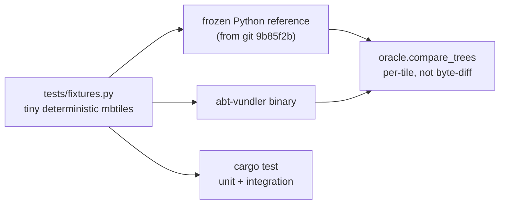

## Current state

- `abtv2-tools/vundler-rs` has 12 inline unit tests, all passing (`cargo test`). No integration tests, no `tests/` directory.
- **The golden oracle is broken.** [bench/README.md](abtv2-tools/vundler-rs/bench/README.md) admits it: once [abt/vundler.py](abtv2-tools/abt/vundler.py) was rewired to shell out to the Rust binary, `run_python.py` stopped exercising independent logic — it now invokes the same binary it is supposed to check. The pre-port `BundleWriter` exists only in git history at `9b85f2b`.
- **Fixtures are unreproducible.** `bench/fixtures/` is gitignored and totals 245 MB (`truncation_source.mbtiles` alone is 222 MB), so nothing is committed and nothing is CI-runnable.
- **Python has zero tests and no manifest.** No `pyproject.toml`/`requirements.txt`/`pytest.ini`. `env.yaml` is a conda spec with no pytest. In this environment only 5 of 15 modules import — `typer`, `psycopg2`, `pyproj`, `tqdm`, `bs4` are all missing.
- `abt/cli_funcs/__init__.py` is missing (works only via PEP 420 namespace packages).

## Part A: Rust vundler harness

**A1. Freeze the reference implementation.** Extract the pre-port `BundleWriter`/`_convert_level`/`_write_metadata` from `git show 9b85f2b:abtv2-tools/abt/vundler.py` into `vundler-rs/tests/reference/vundler_reference.py`, as a standalone stdlib-only module (take plain `mbtiles_path`/`output_dir`/`max_zoom` args instead of importing `VundlerConverter`, so the oracle needs no pydantic and never drifts with the live code). Header comment states it is a frozen oracle and must not be "fixed" to match the Rust output.

**A2. Replace 245 MB fixtures with tiny targeted ones.** New `vundler-rs/tests/fixtures.py` reusing `make_fixtures.py`'s deterministic `tile_payload`. The existing fixtures are huge because they fill entire zooms (`full_zoom(8)` = 65,536 tiles); the same edge coverage comes from placing tiles *at* the boundaries instead of filling them: single tile at z0; tiles at col/row 127 and 128 across a bundle seam; a sub-bundle zoom (z6, 64x64 < 128); sparse high zoom; `map` row with no matching `images` row; missing `metadata` table vs. present-but-no-`json`-row; zero tiles. Generated into `tmp_path` at test time, nothing committed. Keep `bench/` as-is for real-file benchmarking.

**A3. Golden cross-check test.** `vundler-rs/tests/test_golden.py` (pytest): for each fixture, run the frozen reference and the Rust binary into two temp trees, compare with `oracle.compare_trees`. Includes the `--max-zoom` truncation case. Skips with a clear reason if the binary is not built.

**A4. Rust integration tests.** `vundler-rs/tests/cli.rs` driving `env!("CARGO_BIN_EXE_abt-vundler")`: end-to-end conversion, `metadata.json` byte-exactness, empty-input run (no `tile/` dir but metadata still written), `--max-zoom` truncation, `--num-workers 1` vs. default producing identical output, and a nonexistent input failing with a non-zero exit.

**A5. Fill unit-test gaps** in `bundle.rs`/`db.rs`: `local_index` at all four corners, the `has_map == false` plain-`tiles` fallback (currently untested — every `db` test passes `true`), zoom 0, and the `R####C####` filename width limit (`format!("{:04x}")` overflows to 5 digits above z16, which [oracle.py](abtv2-tools/vundler-rs/bench/oracle.py)'s `len(name) != 10` check rejects).

## Part B: Python harness

**B1. Scaffolding.** `abtv2-tools/pyproject.toml` with `[tool.pytest.ini_options] pythonpath = ["."]`, `requirements-dev.txt` (pytest + the runtime deps from `env.yaml`), and pytest added to `env.yaml`. Add the missing `abt/cli_funcs/__init__.py`.

**B2. Unit tests** in `abtv2-tools/tests/`, no live Postgres/S3/network — grouped by module, covering the functions with real logic:
- `utils`: `default_num_workers` arithmetic, `validate_projection_override` regex, `PGConfig.conn_str` quote-escaping / `uri` / `with_options`, `RunReporter._stage_status` + `overall_status`, `run_subprocess` success and non-zero exit (patching `abt.utils.subprocess_tools.subprocess.Popen`), `extract_zip` flattening (including the silent same-basename overwrite), `ParallelExecutor` success/failure aggregation.
- `export`: `TippecanoeOptions.zoom_flags`/`detail_flag`/`filter`, `TileLayer.from_dict` + `tippecanoe_cmd`/`ogr_cmd`/`ogr_sql`, `Bundler.tile_join_cmd` and `_has_tiles` (real temp sqlite files), `mbtiles_metadata` write/read/strip round-trip.
- `models`: `AuxDataLayer.validate_source` XOR rule, `ImposmMappingFile.validate_mapping_data`, `_geometry_bbox`, `DataSchema` directory validation, `CartoExecutionPlan.load` + `_validate_plan_covers_all_files`.
- `download`: `build_aria2c_cmd`, `get_retry_session` config, `overture_folder_release_by_date`, `planet_mirrors._attr_to_hash` and the `stats[0][1] * 1.5 < stats[1][1]` winner heuristic.
- `cli_funcs`: `resolve_input` precedence and its `FileNotFoundError`, plus `abt/vundler.py`'s `convert()` building the right argv and omitting `--num-workers` when `None`.

Tests pin **current** behavior; where current behavior is a bug, the test asserts the bug and is marked `xfail` with a pointer to the report, so fixing it later flips the test rather than silently changing meaning.

## Part C: Report, then fix what is covered

Write `docs/code-review-findings.md` listing every issue with file:line and severity. Verified highlights:

- `tippecanoe_cmd` (`tile_layer_model.py:294`) and `ogr_cmd` (`:273`) dereference `self.tippecanoe_options`/`self.ogr_export_options`, which `from_dict` (`:141-159`) sets to `None` whenever the layer JSON omits the key — `AttributeError` on any such layer.
- `OSMData.diff_location` (`osm_data_model.py:169`) is a non-`Optional[HttpUrl]` but is fed `properties["urls"].get("updates")` (`:64`), so one extract without an updates feed raises `ValidationError` and kills the whole `getGeoFabrikIndex()` loop.
- `count_features` (`tile_layer_model.py:324-331`) returns `False` for a missing table and `0` for an empty one, so `layer_summary` reports both as "does not exist".
- `verify=False` hardcoded on every download (`downloader.py:84`) with no config path; `get_file`'s `None` return on failure is discarded by `Downloader.download` (`:224-226`).
- Leaked psycopg2 connections: `with self.conn as conn` commits the transaction but never closes (`pg_config.py:136,166,176,199`). Leaked sqlite connection plus swallowed exception in `Bundler._has_tiles` (`bundler_model.py:58-71`).
- `bundled_mbtiles_tmp` (`bundler_model.py:114-119`) omits `parents=True`, unlike every other `mkdir` in the package.
- `run_subprocess` (`subprocess_tools.py:23`) does not use `with subprocess.Popen(...)`, leaking the pipe/child if the read loop raises.
- Stale post-port docs: `cli_funcs/vundler.py:44-46` still describes `num_workers` as "zoom levels to convert concurrently"; `utils/fields.py:120-123` documents aux-before-osm while both `download.py` and `import_to_pg.py` run osm first.
- Rust/Python divergence: `list_zoom_levels`/`enumerate_bundle_keys` read `map` while `fetch_bundle_tiles` reads the `tiles` view, so an orphaned `map` row yields an empty `.bundle` the Python original would not create. Needs a decision, so report only.
- ~20 unused imports (11 in `import_aux_single.py` alone), dead `return 1` in Typer commands, `logging.getLogger` handler-caching hazard for tests.

Then fix only the clear-cut, test-covered items: the two `None` derefs, `diff_location` optionality, `count_features` sentinel, `parents=True`, `_has_tiles` leak, `Popen` context manager, missing `__init__.py`, unused imports, and the stale docstrings. Leave `verify=False`, the psycopg2 connection lifecycle, SQL identifier escaping, `shlex` tokenizing, and the `map`/`tiles` divergence as reported-only, since each needs a product decision.

## Verification

`cargo test` (unit + integration), then `pytest` in both `abtv2-tools/` and `vundler-rs/tests/`, then the golden cross-check against a real `joined.mbtiles` if one is available locally.