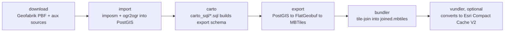

# ABT (Releasable/Army Basemap Tiles) — Ubuntu Setup & Norway Walkthrough

This workspace holds two independent git repositories used together:

- [`abtv2-tools/`](abtv2-tools/) — the Python CLI/orchestration engine (`abt-tools.py`). This is the code that chains external geo tools together.
- [`rbt-schema/`](rbt-schema/) — the schema/config content (imposm mappings, aux-data source configs, SQL transforms, tile export configs) that gets passed to the CLI as `--schema-dir`.

Neither repo is useful without the other: `abtv2-tools` is a generic pipeline runner, and `rbt-schema` defines the specific dataset it builds.

This document covers:

1. What the pipeline does and how it's structured
2. How to provision a fresh Ubuntu 26.04 machine with every dependency it needs
3. A full worked example building tiles for Norway from a Geofabrik extract

## 1. What this pipeline does

ABT turns OpenStreetMap data plus a handful of auxiliary open datasets (Natural Earth, NGA GeoNames, OurAirports, FieldMaps admin boundaries, USGS domestic names, US Dept. of State LSIB, DISDI/MIRTA installations) into a bundled Mapbox vector tileset (`.mbtiles`), with an optional conversion to an Esri Compact Cache V2 tile bundle.

The pipeline is a strict sequence of CLI subcommands — there is no DAG engine, Makefile, or scheduler. Each stage reads from and writes to a `--working-dir` you choose, and reads pipeline configuration from a `--schema-dir` (in practice, your `rbt-schema` checkout):



| Stage | Tool(s) invoked | Reads | Writes |
|---|---|---|---|
| `download` | `requests`, `boto3` (anonymous S3) | Geofabrik/planet index, aux source URLs | `<working_dir>/osm/pbf/`, `<working_dir>/aux_downloads/` |
| `import` | `imposm`, `ogr2ogr` | PBF + aux downloads | Postgres schemas `osm`, `aux_data` |
| `carto` | raw SQL via `psycopg2` | Postgres schemas `osm`, `aux_data` | Postgres schema `export` |
| `export` | `ogr2ogr`, `tippecanoe` | Postgres schema `export` | `<working_dir>/flatgeobuf/*.fgb`, `<working_dir>/mbtiles/*.mbtiles` |
| `bundler` | `tile-join` | `<working_dir>/mbtiles/*` | `<working_dir>/bundled/joined.mbtiles` |
| `vundler` | pure Python (sqlite3) | `bundled/joined.mbtiles` | `<working_dir>/bundled/vundled/p12/` |

Only `download` and `export` skip work that's already done (they check for existing output files). `import`, `carto`, `bundler`, and `vundler` always redo the full operation, so the SQL in `carto_sql/` is written to be safely re-runnable.

For the full CLI reference (every flag), see [`abtv2-tools/README.md`](abtv2-tools/README.md).

## 2. Sizing

The `carto` SQL scripts hardcode session tuning and a fixed degree of parallelism, most visibly in [`rbt-schema/carto_sql/005a_water_polygon.sql`](rbt-schema/carto_sql/005a_water_polygon.sql) and [`rbt-schema/carto_sql/009_land_cover.sql`](rbt-schema/carto_sql/009_land_cover.sql):

```15:21:rbt-schema/carto_sql/005a_water_polygon.sql
SET work_mem = '2GB';
SET maintenance_work_mem = '16GB';
SET max_parallel_workers_per_gather = 10;
SET parallel_setup_cost = 100;
SET parallel_tuple_cost = 0.01;
SET jit = off;
SET synchronous_commit = off;
```

These scripts also open 16 parallel `dblink` worker connections to dissolve global water/land-cover polygons. This is oversized for a single small country, but it is not configurable per-run — it applies to any invocation of `carto`, planet or Norway alike. For this doc:

| Tier | vCPUs | RAM | Disk | Use case |
|---|---|---|---|---|
| **Documented in this guide** | 8 | 32 GB | 100 GB SSD | Norway-sized extracts, single-country test builds |
| Planet-scale (not covered here) | 32+ | 128 GB+ | 2+ TB NVMe | Full-planet builds; expect the `import` step alone to take 24+ hours per the tool's own README |

On the 32 GB tier, Postgres itself should be configured with a much smaller `shared_buffers`/`effective_cache_size` than the `carto_sql` scripts' own per-session `work_mem`/`maintenance_work_mem` overrides — see the `postgresql.conf` block in the next section. The 16 concurrent `dblink` workers each requesting up to 1 GB of `work_mem` (set inside the SQL itself, not from `postgresql.conf`) is comfortably inside 32 GB for a Norway-sized dataset, since the dissolve operates on a small, already-clipped set of polygons.

## 3. Ubuntu 26.04 setup

Run all of this on a fresh Ubuntu 26.04 ("resolute") host. Steps assume a non-root user with `sudo`.

### 3.1 Base packages

```bash
sudo apt update
sudo apt install -y \
  build-essential git curl wget unzip \
  libsqlite3-dev zlib1g-dev sqlite3
```

`libsqlite3-dev` and `zlib1g-dev` are needed to build tippecanoe from source (below); `build-essential` supplies `g++`/`make`; `sqlite3` is the CLI used later to inspect the final `.mbtiles` output.

### 3.2 PostgreSQL 18 + PostGIS 3.6

Ubuntu 26.04 ships PostgreSQL 18 and PostGIS 3.6 in its default repositories — no PGDG repo needed, both comfortably exceed the pipeline's stated minimums (PostgreSQL >=16 / PostGIS >=3.4):

```bash
sudo apt install -y postgresql postgresql-contrib postgresql-18-postgis-3
```

Verify:

```bash
psql --version
```

**Create a database and role.** The `carto` scripts run `CREATE EXTENSION IF NOT EXISTS dblink` and then open password-less internal connections via `dblink_connect` to fan out a parallel polygon dissolve (see [`rbt-schema/carto_sql/005a_water_polygon.sql`](rbt-schema/carto_sql/005a_water_polygon.sql)):

```248:255:rbt-schema/carto_sql/005a_water_polygon.sql
    connstr CONSTANT text := format(
        'dbname=%s options=''-c work_mem=1GB -c synchronous_commit=off -c jit=off''',
        current_database());
    i int;
    n int;
BEGIN
    FOR i IN 0 .. nshards - 1 LOOP
        PERFORM dblink_connect('dissolve_w' || i, connstr);
```

`dblink` will only accept a password-less connection string like this for a Postgres **superuser** (or a role explicitly trusted via `pg_hba.conf`). The simplest path is to make the pipeline's role a superuser:

```bash
sudo -u postgres psql <<'SQL'
CREATE ROLE abt WITH LOGIN SUPERUSER PASSWORD 'abt';
CREATE DATABASE abt_norway OWNER abt;
\c abt_norway
CREATE EXTENSION IF NOT EXISTS postgis;
CREATE EXTENSION IF NOT EXISTS hstore;
CREATE EXTENSION IF NOT EXISTS dblink;
CREATE EXTENSION IF NOT EXISTS pg_trgm;
SQL
```

`hstore` is required because imposm mappings store OSM tags as an `hstore_tags` column (see e.g. `rbt-schema/import/osm/*.yml`); `dblink` is required by the two carto scripts above; `postgis` is required throughout; `pg_trgm` supplies the `%` similarity operator used across `carto_sql` for fuzzy-matching OSM tag values/typos (e.g. `LOWER(service) % 'siding'` in `rbt-schema/carto_sql/004_railway.sql`).

Confirm `pg_hba.conf` allows local password auth for the `abt` role (the default `scram-sha-256`/`peer` mix on a fresh install is normally fine for local TCP connections on `127.0.0.1`; only adjust this if `psql -h 127.0.0.1 -U abt` fails to connect below).

**Tune `postgresql.conf`** for the 32 GB tier (find the file with `sudo -u postgres psql -c 'SHOW config_file;'`):

```conf
shared_buffers = 8GB
effective_cache_size = 24GB
maintenance_work_mem = 2GB
max_worker_processes = 10
max_parallel_workers = 10
max_parallel_workers_per_gather = 4
random_page_cost = 1.1
```

Restart Postgres after editing: `sudo systemctl restart postgresql`.

### 3.3 imposm 0.14+

Not packaged in apt. Install the official static binary (no Go toolchain needed):

```bash
cd /tmp
curl -LO https://github.com/omniscale/imposm3/releases/download/v0.14.2/imposm-0.14.2-linux-x86-64.tar.gz
tar xzf imposm-0.14.2-linux-x86-64.tar.gz
sudo install -m 755 imposm-0.14.2-linux-x86-64/imposm /usr/local/bin/imposm
imposm version
```

### 3.4 tippecanoe 2.76+ (build from source)

Ubuntu 26.04's `tippecanoe` apt package is version 2.53.0 — below the pipeline's required >=2.76. Build the current release from source instead:

```bash
cd /tmp
git clone --branch 2.79.0 --depth 1 https://github.com/felt/tippecanoe.git
cd tippecanoe
make -j"$(nproc)"
sudo make install
tippecanoe --version
tile-join --version
```

Do **not** `sudo apt install tippecanoe` — it will silently satisfy the package manager while installing a version too old for some of the pipeline's export/bundler flags.

### 3.5 GDAL / Python environment

GDAL/`ogr2ogr` >=3.9.2 is required; Ubuntu 26.04 ships GDAL 3.12.2, so the system package alone would suffice for the CLI tool, but the Python side also needs GDAL's Python bindings plus several other packages, all pinned together in [`abtv2-tools/env.yaml`](abtv2-tools/env.yaml). Use conda/Miniforge for this rather than mixing system and pip GDAL builds:

```bash
cd /tmp
curl -L -O https://github.com/conda-forge/miniforge/releases/latest/download/Miniforge3-Linux-x86_64.sh
bash Miniforge3-Linux-x86_64.sh -b -p "$HOME/miniforge3"
source "$HOME/miniforge3/etc/profile.d/conda.sh"
conda init bash
exec bash   # reload shell so `conda` is on PATH
```

Then, from your `abtv2-tools` checkout (see §4 below for cloning):

```bash
cd ~/abt/abtv2-tools
conda env create -f env.yaml
conda activate abtv2
ogr2ogr --version
```

### 3.6 Verify everything

```bash
echo "python:      $(python --version)"
echo "psql:        $(psql --version)"
echo "postgis:     $(psql -d abt_norway -U abt -h 127.0.0.1 -tAc 'SELECT postgis_version();')"
echo "gdal/ogr2ogr: $(ogr2ogr --version)"
echo "imposm:      $(imposm version)"
echo "tippecanoe:  $(tippecanoe --version)"
echo "tile-join:   $(tile-join --version)"
```

You'll be prompted for the `abt` role's password by the `psql` line above unless you export `PGPASSWORD` first.

## 4. Clone both repos

`--schema-dir` must point at an `rbt-schema`-shaped directory, so clone both repos side by side:

```bash
mkdir -p ~/abt && cd ~/abt
git clone git@github.com:ReleaseableBasemapTiles/abtv2-tools.git
git clone git@github.com:ReleaseableBasemapTiles/rbt-schema.git
```

(Use HTTPS clone URLs instead if you don't have SSH keys configured for GitHub.)

If these are private repos and you're using per-repo deploy keys rather than
a single GitHub-wide SSH key, add a `Host` alias per repo to `~/.ssh/config`
instead of relying on the default `github.com` host, since a deploy key can
only authenticate for the one repo it's attached to:

```
Host abtv2-tools
    HostName ssh.github.com
    Port 443
    User git
    IdentityFile ~/.ssh/id_ed25519_abt
    IdentitiesOnly yes

Host rbt-schema
    HostName ssh.github.com
    Port 443
    User git
    IdentityFile ~/.ssh/id_ed25519_rbt
    IdentitiesOnly yes
```

...then clone using the alias as the hostname instead of `github.com`:

```bash
git clone git@abtv2-tools:ReleaseableBasemapTiles/abtv2-tools.git
git clone git@rbt-schema:ReleaseableBasemapTiles/rbt-schema.git
```

`setup_ubuntu.sh` defaults `ABT_TOOLS_REPO`/`ABT_SCHEMA_REPO` to exactly these
alias-based URLs; override them if you're using a different SSH setup or the
plain HTTPS URLs.

## 5. Norway walkthrough

This builds a complete tileset for Norway (Geofabrik key `norway`, PBF currently ~1.4 GB) using the environment set up above.

### 5.1 Configure the database connection

```bash
conda activate abtv2
cd ~/abt/abtv2-tools

export PGHOST=127.0.0.1
export PGPORT=5432
export PGUSER=abt
export PGPASSWORD=abt
export PGDATABASE=abt_norway
```

With these exported, every command below can use `-p env` for `--pg-config`.

### 5.2 Download

```bash
python abt-tools.py download \
  -w ~/abt/run-norway \
  -s ../rbt-schema \
  -d all \
  -k norway \
  -n 4
```

- `-k norway` selects Norway from Geofabrik's live index instead of the default `planet` — **do not omit `-k`**, or this becomes a full-planet download.
- `-d all` downloads both the Norway PBF and every auxiliary dataset (Natural Earth, NGA GeoNames, OurAirports, FieldMaps boundaries, USGS names, DoS LSIB, DISDI/MIRTA, OSM coastline/ocean extracts).
- Output: `~/abt/run-norway/osm/pbf/norway-latest.osm.pbf` and `~/abt/run-norway/aux_downloads/`.
- This step skips files that already exist, so it's safe to re-run if it's interrupted.

### 5.3 Import

```bash
python abt-tools.py import \
  -w ~/abt/run-norway \
  -s ../rbt-schema \
  -d all \
  -n 4 \
  -p env \
  -k norway \
  -c
```

- `-c`/`--clip-aux` clips the globally-scoped aux datasets (Natural Earth, coastlines, etc.) to Norway's bounding box before loading them — this is what keeps a "small area" build fast; it's ignored if `-k` is `planet` or omitted.
- OSM data goes in via `imposm import` into the `osm` schema; aux data goes in via `ogr2ogr` in parallel into the `aux_data` schema (which is dropped and recreated first).
- If you re-run `import` after OSM data already loaded successfully, it will abort with an error unless you add `-f`/`--force` (a full re-import is assumed to be expensive, even though Norway alone is fast).

### 5.4 Carto (SQL transform)

```bash
python abt-tools.py carto \
  -w ~/abt/run-norway \
  -s ../rbt-schema \
  -p env
```

Runs every file in `rbt-schema/carto_sql/*.sql` in filename order, building the `export` schema from `osm`/`aux_data`. This always re-runs from scratch and aborts on the first script that fails — see §6 for the most likely failure here.

### 5.5 Export to tiles

```bash
python abt-tools.py export \
  -w ~/abt/run-norway \
  -s ../rbt-schema \
  -n 4 \
  -p env \
  -z 13
```

For each of the ~58 layers defined in `rbt-schema/export/*.json`: `export.<layer>` → `flatgeobuf/<layer>.fgb` (via `ogr2ogr`) → `mbtiles/<layer>.mbtiles` (via `tippecanoe`, up to zoom 13). Both conversion steps are skipped if their output file already exists, so a partial re-run only redoes missing layers.

### 5.6 Bundle

```bash
python abt-tools.py bundler \
  -w ~/abt/run-norway \
  -s ../rbt-schema \
  -p env
```

Runs `tile-join` across every per-layer `.mbtiles` file, stamping metadata from `rbt-schema/tile-metadata/metadata.py`, and writes `~/abt/run-norway/bundled/joined.mbtiles`.

### 5.7 (Optional) Vundler — Esri tile bundle

```bash
python abt-tools.py vundler \
  -w ~/abt/run-norway \
  -z 13
```

Converts `bundled/joined.mbtiles` into an Esri Compact Cache V2 bundle tree at `bundled/vundled/p12/`. This is not a complete `.vtpk` (no `conf.xml`/`root.json`/styles), just the raw tile bundle structure plus a bare `metadata.json`.

### 5.8 Check the results

Every stage writes a JSON summary and per-tool logs under a timestamped run folder:

```bash
cat ~/abt/run-norway/logs/*/summary.json
```

Inspect the final tileset:

```bash
sqlite3 ~/abt/run-norway/bundled/joined.mbtiles \
  "SELECT name, value FROM metadata;"
```

Or open `bundled/joined.mbtiles` in any MBTiles-aware viewer (e.g. QGIS, tileserver-gl, Mapbox Studio's local preview) to visually confirm Norway's coastline, roads, and place names rendered correctly.

## 6. Troubleshooting

**`ERROR: password is required` / `dblink_connect` fails in `carto`.**
The `abt` role isn't a superuser, or `pg_hba.conf` doesn't trust its local connections. Re-run the `CREATE ROLE ... SUPERUSER` step in §3.2, or add a `trust`/`scram-sha-256` entry for `abt` on `127.0.0.1/32` in `pg_hba.conf` and `sudo systemctl reload postgresql`.

**`carto` fails partway through, referencing `aux_data.mirtalocations_a` (in `023_military.sql`) or another `aux_data.*` table that "doesn't exist".**
This means the corresponding aux source failed to download or import — check `~/abt/run-norway/logs/<run_id>/download/` and `.../import/` for that source's log. The MIRTA/DISDI installations dataset in particular is fetched from `datacollects.blob.core.usgovcloudapi.net` (see [`rbt-schema/import/aux_data/disdi_mirta.json`](rbt-schema/import/aux_data/disdi_mirta.json)) and may be unreachable from some networks; a failed download here doesn't surface as an error until `carto` runs `023_military.sql` and finds the table missing. `carto_sql` scripts are idempotent, so once the underlying aux data is fixed (re-run `download`/`import` for just that source, or use `debug_aux_import`), just re-run `carto` — it always starts from `000_*.sql` again.

**`carto` aborts entirely after one script fails.**
This is expected: [`carto_processing_model.py`](abtv2-tools/abt/carto_processing_model.py) runs `carto_sql/*.sql` in order and stops at the first exception. Fix the root cause, then simply re-run `python abt-tools.py carto ...` — every script drops/recreates its own tables, so re-running is safe.

**A `download` or `import` run appears to be pulling the entire planet.**
`-k`/`--osm-key` defaults to `planet` when omitted. Always pass `-k norway` (or your target Geofabrik key) explicitly.

**`import` aborts with "OSM schema already contains data".**
This is a safety check — a full re-import can take a long time even though Norway itself is quick. Pass `-f`/`--force` to proceed anyway.

**You only need to rebuild one export layer.**
Delete its `flatgeobuf/<layer>.fgb` and/or `mbtiles/<layer>.mbtiles`, then re-run `export`. Deleting only the `.mbtiles` (keeping the `.fgb`) skips straight to the `tippecanoe` step.

**Confirming your Geofabrik key.**
The full list of valid `-k` values is Geofabrik's live index at `https://download.geofabrik.de/index-v1.json`; Norway's `id` is `norway`, and its PBF lives at `https://download.geofabrik.de/europe/norway-latest.osm.pbf`.
