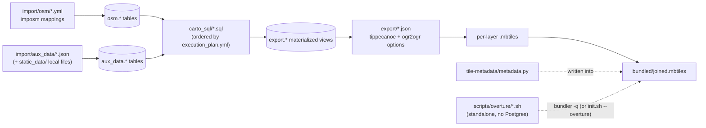

# Architecture

This page explains how the two halves of the monorepo fit together, and how a CLI invocation like `python abt-tools.py export ...` actually turns into subprocess calls against `ogr2ogr`/`tippecanoe`.

## Two repos, merged into one monorepo

`abtv2-tools/` and `rbt-schema/` used to be two separate git repositories. They were merged into this single repo with each subdirectory's full commit history preserved (`git log -- abtv2-tools/` and `git log -- rbt-schema/` still work independently), and a second git remote (`rbt-schema`, pointing at `git@github.com:ReleasableBasemapTiles/rbt-schema.git`) is kept around for periodic history sync — not for live submodule/subtree mounting.

Conceptually the split is engine vs. content:

- **`abtv2-tools`** is the generic pipeline runner. Nothing in it is specific to this tileset's actual layers, attribution, or data sources — it just knows how to read a `--schema-dir` of a certain shape and drive `imposm3`, `ogr2ogr`, `tippecanoe`, `tile-join`, and the Rust vundler against it.
- **`rbt-schema`** is that `--schema-dir`: imposm mapping YAML, aux-data JSON configs, `carto_sql/*.sql` transforms, per-layer export JSON, and tile metadata. It contains no executable pipeline code of its own (aside from the standalone `scripts/overture/` shell scripts).

Neither half is useful alone. See the [Repository Tour](repo-tour.md) for what's inside each, and the [Schema Reference](../schema/index.md) for `rbt-schema`'s file formats in detail.

## From CLI invocation to subprocess

`abt-tools.py` is a [Typer](https://typer.tiangolo.com/) app (`app = typer.Typer(add_completion=False)`). A root `@app.callback()` runs before every command to raise the process's open-file limit (every command shells out to a tool that inherits this process's descriptor limit, and `tippecanoe` in particular scales its own descriptor use to the host's core count), then the entrypoint mounts seven sub-apps, one per subcommand: `download`, `import` (`import_to_pg`), `carto` (`run_carto`), `export` (`export_tiles`), `bundler`, `vundler`, and the debug-only `debug_aux_import` (`import_aux_single`).

Each subcommand follows the same shape: a thin `cli_funcs/*.py` module parses flags and wires up a `DataSchema`/`ProcessingDirectorySchema`, then hands off to a stage-specific engine module that does the real work and ultimately shells out to an external tool. For `export`, concretely:

```text
abt export ...
  -> abt/cli_funcs/export_tiles.py   (Typer command, flag parsing, ProcessingDirectorySchema setup)
  -> abt/export/tile_layer_model.py  (per-layer config: geometry type, attributes, tippecanoe/ogr2ogr options)
  -> abt/export/exporter.py          (builds and runs the ogr2ogr and tippecanoe commands per layer)
  -> ogr2ogr / tippecanoe            (external subprocess tools, actually doing the conversion)
```

The other stages follow the same pattern with their own engine modules — `import` uses `abt/importer/importer.py`, `carto` uses `abt/carto_processing_model.py`, `bundler` uses `abt/export/bundler.py` plus `abt/export/bundler_model.py`, and `vundler` uses `abt/vundler.py`/`abt/vundler_model.py` (or, in production, the Rust rewrite in `vundler-rs/` — see [vundler-rs](../reference/vundler-rs.md)). See the [Pipeline Stages](../pipeline/download.md) section for each stage's own page, and the [abt-tools CLI reference](../reference/cli.md) for the full flag surface.

## The PostgreSQL schema flow

`rbt-schema`'s own data-flow diagram shows how a schema dir's files become tiles, independent of any specific CLI command's internals:



The two dotted arrows are **not** run by `abt-tools.py` automatically:

- `tile-metadata/metadata.py` is loaded and written in by `bundler` itself — it isn't a pipeline stage of its own, just a file `bundler` reads once and stamps into the joined `mbtiles`' `metadata` table.
- `scripts/overture/` (the standalone Overture Maps buildings pipeline) isn't invoked by `abt-tools.py` at all. Its output is folded into the same bundle later, either by hand via `bundler`'s `-q/--additional-mbtiles` flag, or automatically via [`init.sh --overture`](../walkthroughs/init-sh.md). See [Overture Buildings](../pipeline/overture.md) for how that pipeline works.

## Where to go next

- [Schema Reference overview](../schema/index.md) — the full layout and validation rules for `--schema-dir`.
- [Pipeline Stages](../pipeline/download.md) — one page per CLI stage, with flags and behavior.
- [init.sh Orchestrator](../walkthroughs/init-sh.md) — the production script that drives every stage (plus Overture and multi-projection builds) end to end.
- [vundler-rs](../reference/vundler-rs.md) — the Rust rewrite of the `vundler` stage used in production.
- [Repository Tour](repo-tour.md) — a directory-by-directory map of the monorepo.
