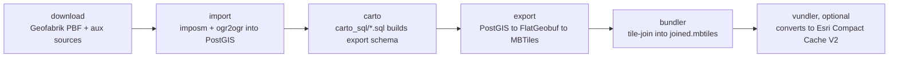

# Pipeline

ABT turns OpenStreetMap data plus a handful of auxiliary open datasets (Natural Earth, NGA GeoNames, OurAirports, FieldMaps admin boundaries, USGS domestic names, US Dept. of State LSIB, DISDI/MIRTA installations) into a bundled Mapbox vector tileset (`.mbtiles`), with an optional conversion to an Esri Compact Cache V2 tile bundle.

!!! note "No DAG engine"
    The pipeline is a strict sequence of CLI subcommands — there is no DAG engine, Makefile, or scheduler. Each stage reads from and writes to a `--working-dir` you choose, and reads pipeline configuration from a `--schema-dir` (in practice, your `rbt-schema` checkout). Within the `carto` stage itself, independent `carto_sql/*.sql` scripts can run concurrently against Postgres.



## Stages at a glance

| Stage | Tool(s) invoked | Reads | Writes |
|---|---|---|---|
| `download` | `requests` (Geofabrik extracts, aux), `aria2c` (planet), `boto3` (anonymous S3) | Geofabrik/planet index, aux source URLs | `<working_dir>/osm/pbf/`, `<working_dir>/aux_downloads/` |
| `import` | `imposm`, `ogr2ogr` | PBF + aux downloads | Postgres schemas `osm`, `aux_data` |
| `carto` | raw SQL via `psycopg2`, optionally several scripts at once | Postgres schemas `osm`, `aux_data` | Postgres schema `export` |
| `export` | `ogr2ogr`, `tippecanoe` | Postgres schema `export` | `<working_dir>/flatgeobuf/*.fgb`, `<working_dir>/mbtiles/*.mbtiles` |
| `bundler` | `tile-join` | `<working_dir>/mbtiles/*` | `<working_dir>/bundled/joined.mbtiles` |
| `vundler` | pure Python (sqlite3), concurrent per zoom level | `bundled/joined.mbtiles` | `<working_dir>/bundled/vundled/p12/` |

Each row links to a dedicated stage page with full flag documentation: [Download](../pipeline/download.md), [Import](../pipeline/import.md), [Carto](../pipeline/carto.md), [Export](../pipeline/export.md), [Bundler](../pipeline/bundler.md), [Vundler](../pipeline/vundler.md). See also the [abt-tools CLI reference](../reference/cli.md) for every flag across every command.

!!! tip "Idempotency varies by stage"
    Only `download` and `export` skip work that's already done (they check for existing output files first). `import`, `carto`, `bundler`, and `vundler` always redo the full operation from scratch, so `carto_sql/` SQL is written to be safely re-runnable, and re-running `bundler`/`vundler` is expected to cost the full stage time again.

`bundler` also accepts `-z/--max-zoom` to cap the joined output at a given zoom level (e.g. a smaller "RBT Small" package alongside the full-resolution one). Each input is pre-trimmed with SQLite before `tile-join` runs, rather than relying on `tile-join` itself to filter by zoom.

## Parallelism and carto concurrency

`carto` groups `carto_sql/*.sql` scripts according to `rbt-schema/carto_sql/execution_plan.yml`:

1. **Prefix** — a small sequential prefix (`000_update_aux_geom.sql`, `001_set_schema.sql`) creates the `export` schema and every carto-owned custom schema/extension up front.
2. **Groups** — independent script groups then run concurrently against Postgres, up to `-n/--carto-concurrency` at a time, one Postgres connection per group.
3. **Suffix** — a sequential suffix (`099_update_geometry.sql`) normalizes everything once every group has finished.

`--carto-concurrency` defaults to a value scaled to the host's CPU count (`cpu_count // 6`, floored at 1) rather than a flat default. A script failing aborts only its own group — every other independent group still runs to completion — and the sequential suffix only runs if every group succeeded.

If `carto_sql/execution_plan.yml` is missing from `--schema-dir` (an older or third-party schema dir), or `--carto-concurrency 1` is passed explicitly, `carto` falls back to running every script sequentially in filename order, exactly as before this feature existed.

See [Carto SQL](../schema/carto-sql.md) for the SQL-script-level mechanics of `execution_plan.yml`, and [Performance & Sizing](../install/performance.md) for how concurrency and per-session Postgres tuning interact on large hosts.

## What `--schema-dir` must contain

All commands take `-w/--working-dir` (output) and `-s/--schema-dir` (input config). `--schema-dir` — in practice your `rbt-schema` checkout — must contain:

```text
import/osm/        imposm mapping YAML
import/aux_data/   aux data JSON configs
export/            per-layer export JSON configs
carto_sql/         SQL scripts; filename order by default, or grouped by an optional carto_sql/execution_plan.yml
tile-metadata/     metadata.py, defines a `metadata` dict (name, description, attribution, tags, license, etc.) written into the bundled mbtiles — required by `bundler`
```

See the [Schema Reference overview](../schema/index.md) for a full tour of each of these directories, and [Configuration](../install/configuration.md) for how `--schema-dir` validation works.

## Where to go next

- [Architecture](architecture.md) — how the CLI's code maps onto these stages internally.
- [Repository Tour](repo-tour.md) — what lives in each directory of the monorepo.
- [Norway walkthrough](../walkthroughs/norway.md) and [Planet walkthrough](../walkthroughs/planet.md) — this sequence run end-to-end, at two different scales.
- [init.sh Orchestrator](../walkthroughs/init-sh.md) — the production script that runs all of these stages (plus Overture buildings) automatically.
