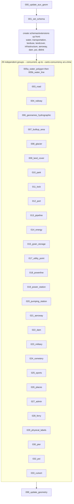

# Carto SQL

`carto_sql/` holds 33 numbered SQL scripts (plus `099_update_geometry.sql`)
that read `osm.*`/`aux_data.*` and build every `export.*` table — always as a
`CREATE MATERIALIZED VIEW` (zero plain `CREATE VIEW` objects under `export`;
every layer's data is materialized at [Carto](../pipeline/carto.md) time, not
read live at export time).

Each script follows the same shape: a header comment naming the
layer/schema/sources, then one or more

```sql
BEGIN;
DROP ... CASCADE;
CREATE MATERIALIZED VIEW ...;
CREATE INDEX ...;
COMMIT;
```

blocks. Numeric filename prefixes control ordering; gaps are fine (no `002`
or `016`, `031` only exists as `.skip`'d — see
[Adding a Layer](adding-a-layer.md)).

!!! warning "Scripts must be safe to re-run"
    `carto` always redoes the full stage from scratch — the
    `DROP ... IF EXISTS ... CASCADE` at the top of every block is what makes
    that safe.

## Prefix and suffix

`000_update_aux_geom.sql`/`001_set_schema.sql` (prefix) and
`099_update_geometry.sql` (suffix) always run first/last, sequentially. The
prefix normalizes every `aux_data.*` table's geometry column (renames to
`geometry`, reprojects 3857→4326, indexes) and (re)creates the `export`
schema; the suffix does the same normalization pass over `export.*` once
every layer has been built.

Example (`001_set_schema.sql`, abridged):

```sql
BEGIN;
CREATE OR REPLACE FUNCTION public.ZRes(z integer)
RETURNS float
LANGUAGE SQL IMMUTABLE STRICT PARALLEL SAFE
AS $func$
SELECT (40075016.6855785 / (256 * 2^z));
$func$;
COMMIT;
```

## `execution_plan.yml`

Declares which of the remaining scripts can run concurrently against
Postgres (read by `abt-tools.py carto`'s `-n/--carto-concurrency`; falls back
to strict filename order if absent) — 29 groups today, all independent
except one real dependency:

```yaml
groups:
  # 005b reads water.classify_water_type(), a function created by 005a --
  # a real execution-order dependency, not just a shared schema name.
  - [005a_water_polygon.sql, 005b_water_line.sql]

  # Everything else only ever shared a *schema name* with another script
  # (e.g. 004_railway.sql creates transportation.railway_normalized, but
  # never reads 003_road.sql's transportation.usa_boundary) -- now that
  # custom_schemas above are created up front, each of these is independent.
  - [003_road.sql]
  - [004_railway.sql]
```

It also lists every custom schema (`water`, `transportation`, `landuse`,
`landcover`, `infrastructure`, `aeroway`, `dam`, `poi`) and extension
(`dblink`) these scripts create, so they're created once up front instead of
racing across concurrent sessions the first time. Its own header documents
exactly how to update it when `carto_sql` changes:

```text
# How to update this file when carto_sql changes:
#   1. New script with no custom schema, reading only osm.*/aux_data.* and
#      writing its own export.* tables: add it as its own single-item group.
#   2. New script that creates a *new* custom schema: add the schema name to
#      custom_schemas, add the script as its own group.
#   3. New script that reads/writes a table (not just a schema name) created
#      by another script: add it to that script's group, after it, in the
#      same inner list.
#   4. Deleted/renamed script: remove/update its entry above.
#   5. When in doubt, add it as a new single-item group and grep the rest of
#      carto_sql for its schema/table names to confirm nothing else depends
#      on it.
```

`execution_plan.yml` is validated against the actual `*.sql` files present
before any run starts — a script on disk but missing from the plan, a plan
entry with no matching file, or a duplicate all fail fast rather than
silently building an incomplete tileset.

## More views than are tiled

**`carto_sql` can produce more `export.*` views than are actually tiled.**
`025_sports.sql` builds `export.golf_course` and `export.sports_ground`, but
neither has a matching `export/*.json`. Every one of the 58 files in
`export/` does have a matching `CREATE MATERIALIZED VIEW export.<layer_id>`
somewhere in `carto_sql`, but the reverse isn't guaranteed.

!!! note "The binding is purely by naming convention"
    `export/<layer_id>.json` ↔ `export.<layer_id>` — nothing enforces it, so
    a typo in either place just makes a layer silently fail to
    export/tile. See the [Layer Registry](layers.md) and
    [Export](../pipeline/export.md).

## `carto_sql/static_data/`

A second, unrelated "static data" concept from the top-level
[`static_data/`](aux-data.md#static_data-bundled-local-data-files):
standalone SQL that seeds a table directly via plain `INSERT` statements,
bypassing download/extract/`ogr2ogr` entirely. Because `carto`'s script
discovery globs `carto_sql/*.sql` non-recursively, nothing in this subfolder
ever runs automatically — it's a manual alternative for seeding
`aux_data.ne_physical_centerlines` with plain `psql`.

See [Performance & Sizing](../install/performance.md) for the
concurrency/sizing angle and [Carto](../pipeline/carto.md) for the CLI
command itself.

## Execution graph

Generated from `carto_sql/execution_plan.yml` at doc-build time — always in sync with the actual file.

<!-- CARTO_DAG_START -->


29 independent groups (from `execution_plan.yml`) run concurrently, up to `-n/--carto-concurrency` at a time, between a 2-script sequential prefix and a 1-script sequential suffix. Custom schemas/extensions are created once up front, before any group starts: `water`, `transportation`, `landuse`, `landcover`, `infrastructure`, `aeroway`, `dam`, `poi`, `dblink`.
<!-- CARTO_DAG_END -->

## See also

- [Schema Reference Overview](index.md)
- [OSM Mappings](osm-mappings.md) and [Auxiliary Data](aux-data.md) — the upstream sources these scripts read
- [Adding a Layer](adding-a-layer.md) — the `.skip` convention and the full new-layer workflow
