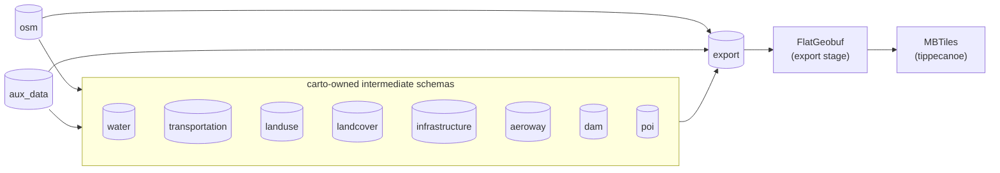
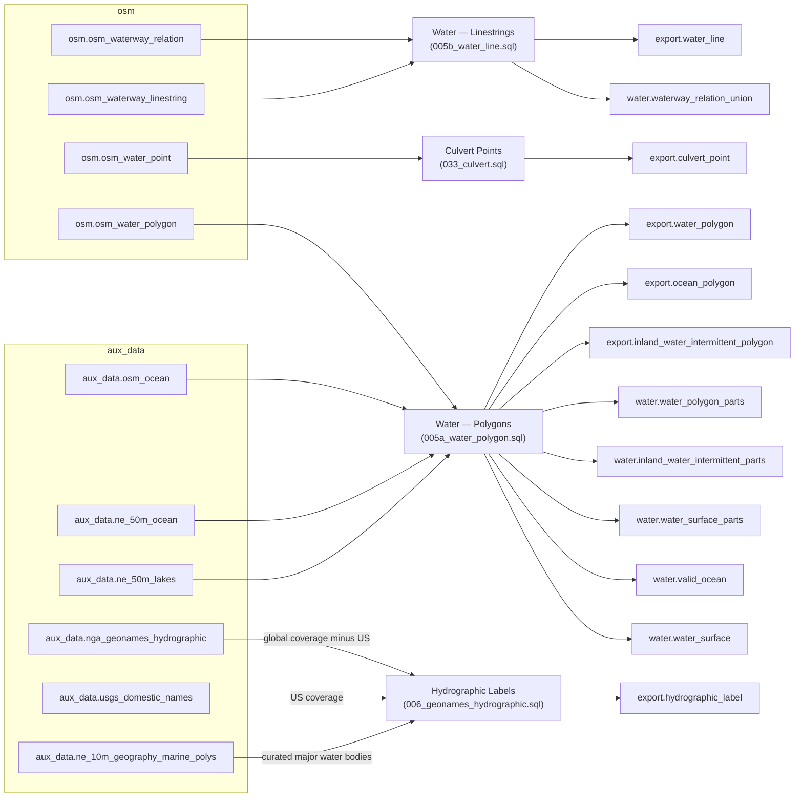
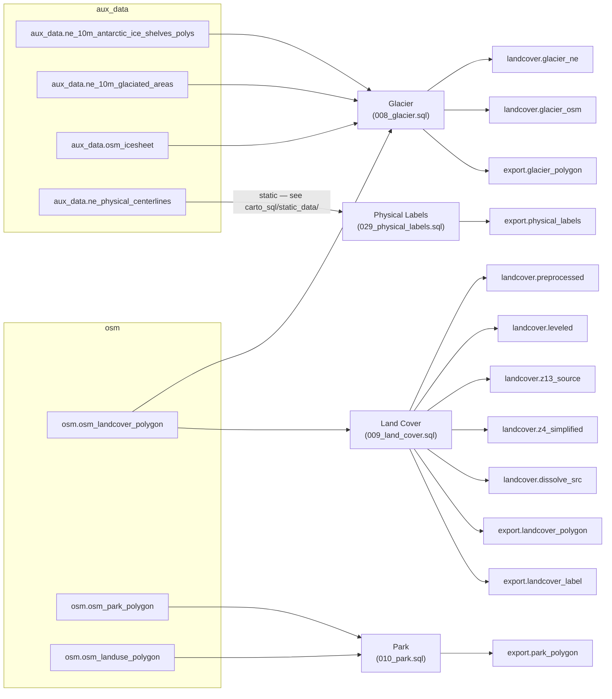
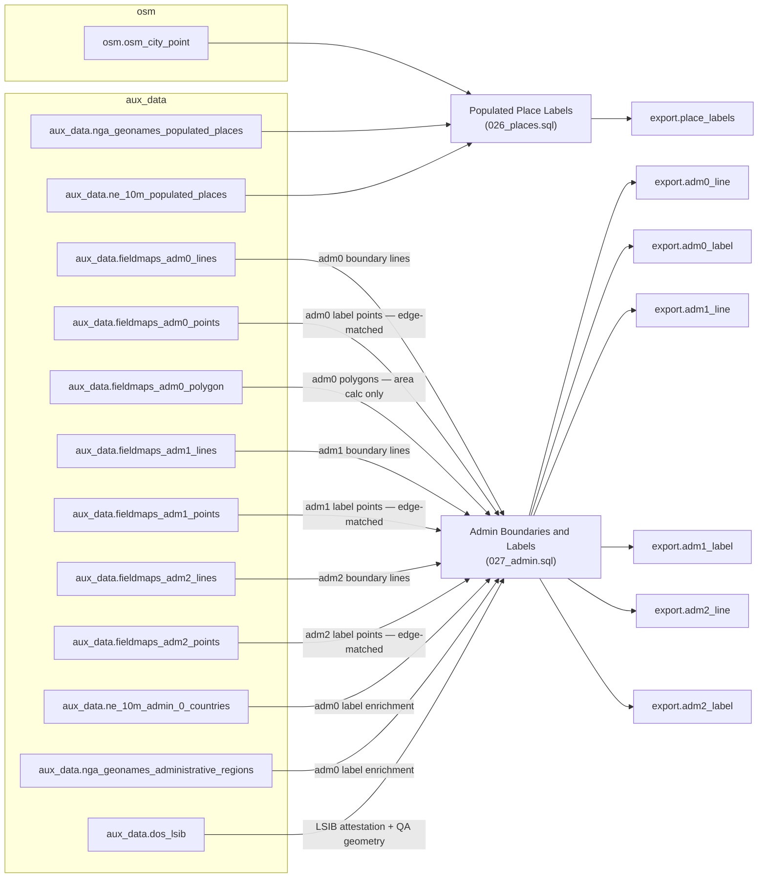
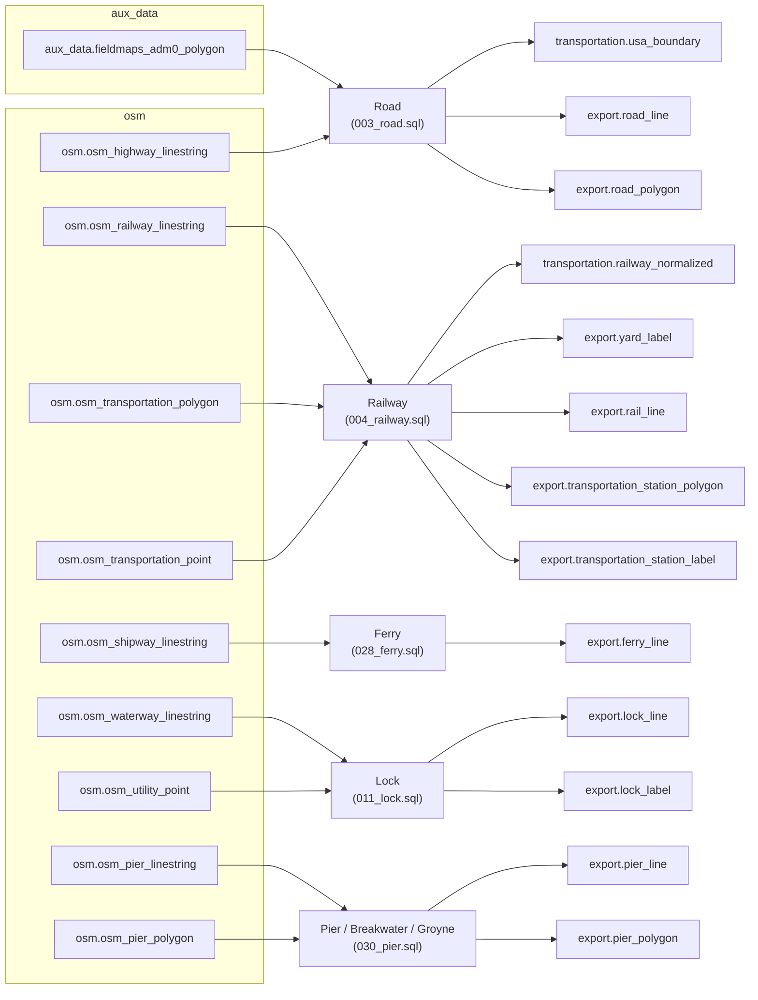
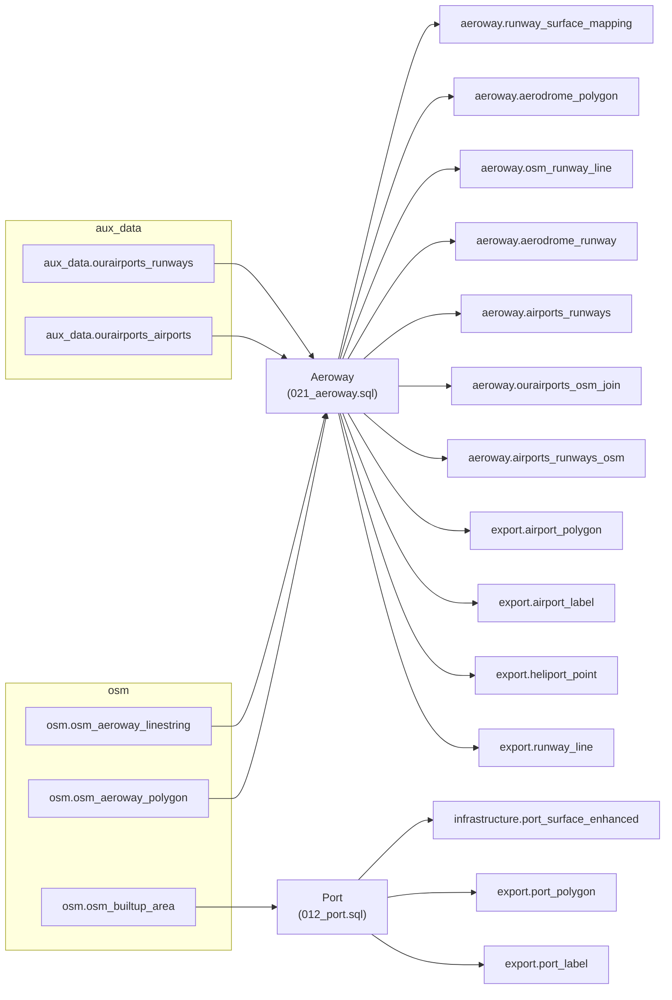
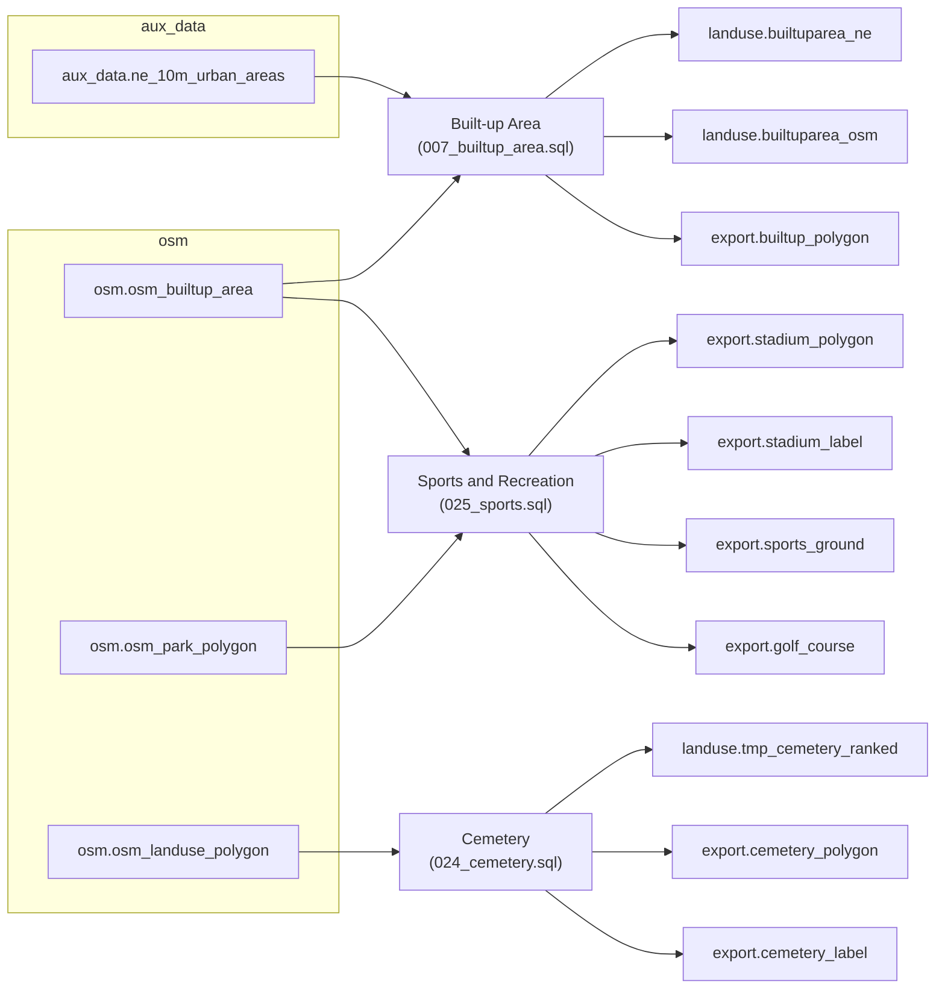
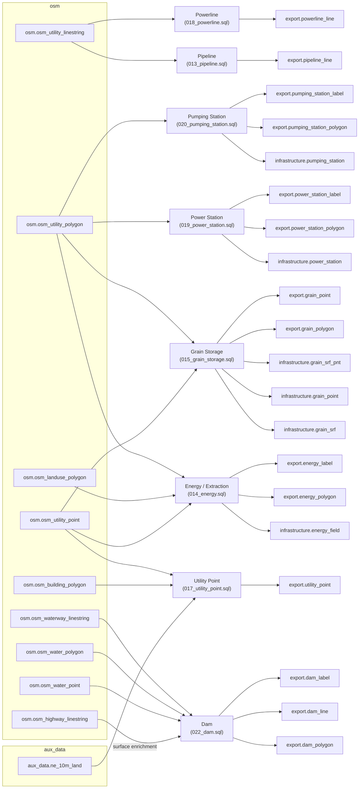
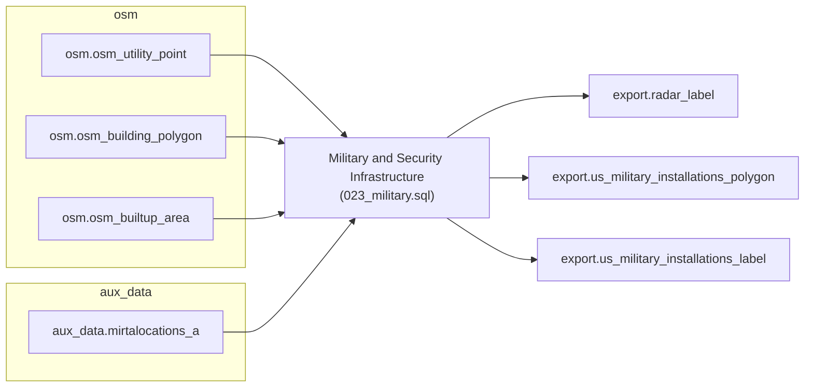
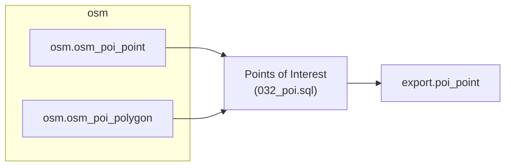

<!-- THIS FILE IS GENERATED by docs/_hooks/gen_db_schema.py at docs build
     time from rbt-schema/carto_sql/*.sql header comments and
     rbt-schema/export/*.json. Edit those files, not this one -- `mkdocs
     build` regenerates it, and a committed copy is kept so the page is
     browsable on GitHub without running a build. -->

# Database Schema

This page documents the PostgreSQL schemas `carto` builds and traces every
`export.*` materialized view back to the `osm.*`/`aux_data.*` source tables
and carto-owned intermediate schemas it's built from. It's generated from
each [`carto_sql/*.sql`](carto-sql.md) script's own header comment (`LAYER`/
`Sources`/`Intermediates`) plus its `CREATE MATERIALIZED VIEW` statements,
cross-referenced against [`export/*.json`](layers.md) for geometry type,
zoom range, and whether a view is actually tiled -- so it can't drift from
the SQL. See [Adding a Layer](adding-a-layer.md) for the workflow this
schema supports.

## Overview

| Schema | Loaded by | Contents |
|---|---|---|
| `osm` | `import` (imposm3) | 24 distinct OSM source tables referenced below |
| `aux_data` | `import` (ogr2ogr) | 27 distinct auxiliary source tables referenced below (Natural Earth, NGA GeoNames, OurAirports, FieldMaps, USGS, DoS LSIB, DISDI/MIRTA, OSM coastline/ocean extracts, and any bundled `static_data/` file) — see [Auxiliary Data](aux-data.md) |
| `water` | `carto` (SQL transforms) | Intermediate staging tables/views for the `water`-owned layer(s) below |
| `transportation` | `carto` (SQL transforms) | Intermediate staging tables/views for the `transportation`-owned layer(s) below |
| `landuse` | `carto` (SQL transforms) | Intermediate staging tables/views for the `landuse`-owned layer(s) below |
| `landcover` | `carto` (SQL transforms) | Intermediate staging tables/views for the `landcover`-owned layer(s) below |
| `infrastructure` | `carto` (SQL transforms) | Intermediate staging tables/views for the `infrastructure`-owned layer(s) below |
| `aeroway` | `carto` (SQL transforms) | Intermediate staging tables/views for the `aeroway`-owned layer(s) below |
| `dam` | `carto` (SQL transforms) | Intermediate staging tables/views for the `dam`-owned layer(s) below |
| `poi` | `carto` (SQL transforms) | Intermediate staging tables/views for the `poi`-owned layer(s) below |
| `export` | `carto` (SQL transforms) | 60 materialized views, 58 of which are tiled — see [Layer Registry](layers.md) |

Every `export.*` view is a `CREATE MATERIALIZED VIEW` — see [Carto SQL](carto-sql.md) for the prefix/concurrent-groups/suffix execution model that builds them, and the sections below for the full source-to-view trace, by theme.

## Water & hydrography

| Export view | Built by | Sources | Intermediates | Geometry | Zoom | Tiled |
|---|---|---|---|---|---|---|
| `export.inland_water_intermittent_polygon` | `005a_water_polygon.sql` | `osm.osm_water_polygon` `aux_data.osm_ocean` `aux_data.ne_50m_ocean` `aux_data.ne_50m_lakes` | `water.water_surface` `water.valid_ocean` `water.water_surface_parts` `water.inland_water_intermittent_parts` `water.water_polygon_parts` | polygon | 8–13 | Yes |
| `export.ocean_polygon` | `005a_water_polygon.sql` | `osm.osm_water_polygon` `aux_data.osm_ocean` `aux_data.ne_50m_ocean` `aux_data.ne_50m_lakes` | `water.water_surface` `water.valid_ocean` `water.water_surface_parts` `water.inland_water_intermittent_parts` `water.water_polygon_parts` | polygon | 0–13 | Yes |
| `export.water_polygon` | `005a_water_polygon.sql` | `osm.osm_water_polygon` `aux_data.osm_ocean` `aux_data.ne_50m_ocean` `aux_data.ne_50m_lakes` | `water.water_surface` `water.valid_ocean` `water.water_surface_parts` `water.inland_water_intermittent_parts` `water.water_polygon_parts` | polygon | 0–13 | Yes |
| `export.water_line` | `005b_water_line.sql` | `osm.osm_waterway_relation` `osm.osm_waterway_linestring` | `water.waterway_relation_union` | linestring | 6–13 | Yes |
| `export.hydrographic_label` | `006_geonames_hydrographic.sql` | `aux_data.nga_geonames_hydrographic` (global coverage minus US) `aux_data.usgs_domestic_names` (US coverage) `aux_data.ne_10m_geography_marine_polys` (curated major water bodies) | — | point | 0–13 | Yes |
| `export.culvert_point` | `033_culvert.sql` | `osm.osm_water_point` | — | point | 9–13 | Yes |

## Terrain, landcover & parks

| Export view | Built by | Sources | Intermediates | Geometry | Zoom | Tiled |
|---|---|---|---|---|---|---|
| `export.glacier_polygon` | `008_glacier.sql` | `aux_data.ne_10m_antarctic_ice_shelves_polys` `aux_data.ne_10m_glaciated_areas` `osm.osm_landcover_polygon` `aux_data.osm_icesheet` | `landcover.glacier_ne` `landcover.glacier_osm` | polygon | 0–13 | Yes |
| `export.landcover_polygon` | `009_land_cover.sql` | `osm.osm_landcover_polygon` | `landcover.preprocessed` `landcover.leveled` `landcover.z13_source` `landcover.z4_simplified` `landcover.dissolve_src` | polygon | 4–13 | Yes |
| `export.landcover_label` | `009_land_cover.sql` | `osm.osm_landcover_polygon` | `landcover.preprocessed` `landcover.leveled` `landcover.z13_source` `landcover.z4_simplified` `landcover.dissolve_src` | point | 4–13 | Yes |
| `export.park_polygon` | `010_park.sql` | `osm.osm_park_polygon` `osm.osm_landuse_polygon` | — | polygon | 9–13 | Yes |
| `export.physical_labels` | `029_physical_labels.sql` | `aux_data.ne_physical_centerlines` (static — see carto_sql/static_data/) | — | linestring | 3–13 | Yes |

## Boundaries & places

| Export view | Built by | Sources | Intermediates | Geometry | Zoom | Tiled |
|---|---|---|---|---|---|---|
| `export.place_labels` | `026_places.sql` | `osm.osm_city_point` `aux_data.nga_geonames_populated_places` `aux_data.ne_10m_populated_places` | — | point | 3–13 | Yes |
| `export.adm0_line` | `027_admin.sql` | `aux_data.fieldmaps_adm0_lines` (adm0 boundary lines) `aux_data.fieldmaps_adm0_points` (adm0 label points — edge-matched) `aux_data.fieldmaps_adm0_polygon` (adm0 polygons — area calc only) `aux_data.fieldmaps_adm1_lines` (adm1 boundary lines) `aux_data.fieldmaps_adm1_points` (adm1 label points — edge-matched) `aux_data.fieldmaps_adm2_lines` (adm2 boundary lines) `aux_data.fieldmaps_adm2_points` (adm2 label points — edge-matched) `aux_data.ne_10m_admin_0_countries` (adm0 label enrichment) `aux_data.nga_geonames_administrative_regions` (adm0 label enrichment) `aux_data.dos_lsib` (LSIB attestation + QA geometry) | — | linestring | 0–13 | Yes |
| `export.adm0_label` | `027_admin.sql` | `aux_data.fieldmaps_adm0_lines` (adm0 boundary lines) `aux_data.fieldmaps_adm0_points` (adm0 label points — edge-matched) `aux_data.fieldmaps_adm0_polygon` (adm0 polygons — area calc only) `aux_data.fieldmaps_adm1_lines` (adm1 boundary lines) `aux_data.fieldmaps_adm1_points` (adm1 label points — edge-matched) `aux_data.fieldmaps_adm2_lines` (adm2 boundary lines) `aux_data.fieldmaps_adm2_points` (adm2 label points — edge-matched) `aux_data.ne_10m_admin_0_countries` (adm0 label enrichment) `aux_data.nga_geonames_administrative_regions` (adm0 label enrichment) `aux_data.dos_lsib` (LSIB attestation + QA geometry) | — | point | 0–13 | Yes |
| `export.adm1_line` | `027_admin.sql` | `aux_data.fieldmaps_adm0_lines` (adm0 boundary lines) `aux_data.fieldmaps_adm0_points` (adm0 label points — edge-matched) `aux_data.fieldmaps_adm0_polygon` (adm0 polygons — area calc only) `aux_data.fieldmaps_adm1_lines` (adm1 boundary lines) `aux_data.fieldmaps_adm1_points` (adm1 label points — edge-matched) `aux_data.fieldmaps_adm2_lines` (adm2 boundary lines) `aux_data.fieldmaps_adm2_points` (adm2 label points — edge-matched) `aux_data.ne_10m_admin_0_countries` (adm0 label enrichment) `aux_data.nga_geonames_administrative_regions` (adm0 label enrichment) `aux_data.dos_lsib` (LSIB attestation + QA geometry) | — | linestring | 3–13 | Yes |
| `export.adm1_label` | `027_admin.sql` | `aux_data.fieldmaps_adm0_lines` (adm0 boundary lines) `aux_data.fieldmaps_adm0_points` (adm0 label points — edge-matched) `aux_data.fieldmaps_adm0_polygon` (adm0 polygons — area calc only) `aux_data.fieldmaps_adm1_lines` (adm1 boundary lines) `aux_data.fieldmaps_adm1_points` (adm1 label points — edge-matched) `aux_data.fieldmaps_adm2_lines` (adm2 boundary lines) `aux_data.fieldmaps_adm2_points` (adm2 label points — edge-matched) `aux_data.ne_10m_admin_0_countries` (adm0 label enrichment) `aux_data.nga_geonames_administrative_regions` (adm0 label enrichment) `aux_data.dos_lsib` (LSIB attestation + QA geometry) | — | point | 3–13 | Yes |
| `export.adm2_line` | `027_admin.sql` | `aux_data.fieldmaps_adm0_lines` (adm0 boundary lines) `aux_data.fieldmaps_adm0_points` (adm0 label points — edge-matched) `aux_data.fieldmaps_adm0_polygon` (adm0 polygons — area calc only) `aux_data.fieldmaps_adm1_lines` (adm1 boundary lines) `aux_data.fieldmaps_adm1_points` (adm1 label points — edge-matched) `aux_data.fieldmaps_adm2_lines` (adm2 boundary lines) `aux_data.fieldmaps_adm2_points` (adm2 label points — edge-matched) `aux_data.ne_10m_admin_0_countries` (adm0 label enrichment) `aux_data.nga_geonames_administrative_regions` (adm0 label enrichment) `aux_data.dos_lsib` (LSIB attestation + QA geometry) | — | linestring | 11–13 | Yes |
| `export.adm2_label` | `027_admin.sql` | `aux_data.fieldmaps_adm0_lines` (adm0 boundary lines) `aux_data.fieldmaps_adm0_points` (adm0 label points — edge-matched) `aux_data.fieldmaps_adm0_polygon` (adm0 polygons — area calc only) `aux_data.fieldmaps_adm1_lines` (adm1 boundary lines) `aux_data.fieldmaps_adm1_points` (adm1 label points — edge-matched) `aux_data.fieldmaps_adm2_lines` (adm2 boundary lines) `aux_data.fieldmaps_adm2_points` (adm2 label points — edge-matched) `aux_data.ne_10m_admin_0_countries` (adm0 label enrichment) `aux_data.nga_geonames_administrative_regions` (adm0 label enrichment) `aux_data.dos_lsib` (LSIB attestation + QA geometry) | — | point | 11–13 | Yes |

## Transportation

| Export view | Built by | Sources | Intermediates | Geometry | Zoom | Tiled |
|---|---|---|---|---|---|---|
| `export.road_line` | `003_road.sql` | `osm.osm_highway_linestring` `aux_data.fieldmaps_adm0_polygon` | `transportation.usa_boundary` | linestring | 6–13 | Yes |
| `export.road_polygon` | `003_road.sql` | `osm.osm_highway_linestring` `aux_data.fieldmaps_adm0_polygon` | `transportation.usa_boundary` | polygon | 12–13 | Yes |
| `export.yard_label` | `004_railway.sql` | `osm.osm_railway_linestring` `osm.osm_transportation_polygon` `osm.osm_transportation_point` | `transportation.railway_normalized` | point | 10–13 | Yes |
| `export.rail_line` | `004_railway.sql` | `osm.osm_railway_linestring` `osm.osm_transportation_polygon` `osm.osm_transportation_point` | `transportation.railway_normalized` | linestring | 8–13 | Yes |
| `export.transportation_station_polygon` | `004_railway.sql` | `osm.osm_railway_linestring` `osm.osm_transportation_polygon` `osm.osm_transportation_point` | `transportation.railway_normalized` | polygon | 11–13 | Yes |
| `export.transportation_station_label` | `004_railway.sql` | `osm.osm_railway_linestring` `osm.osm_transportation_polygon` `osm.osm_transportation_point` | `transportation.railway_normalized` | point | 11–13 | Yes |
| `export.ferry_line` | `028_ferry.sql` | `osm.osm_shipway_linestring` | — | linestring | 8–13 | Yes |
| `export.lock_line` | `011_lock.sql` | `osm.osm_waterway_linestring` `osm.osm_utility_point` | — | linestring | 9–13 | Yes |
| `export.lock_label` | `011_lock.sql` | `osm.osm_waterway_linestring` `osm.osm_utility_point` | — | point | 9–13 | Yes |
| `export.pier_line` | `030_pier.sql` | `osm.osm_pier_linestring` `osm.osm_pier_polygon` | — | linestring | 12–13 | Yes |
| `export.pier_polygon` | `030_pier.sql` | `osm.osm_pier_linestring` `osm.osm_pier_polygon` | — | polygon | 12–13 | Yes |

## Aviation & ports

| Export view | Built by | Sources | Intermediates | Geometry | Zoom | Tiled |
|---|---|---|---|---|---|---|
| `export.airport_polygon` | `021_aeroway.sql` | `osm.osm_aeroway_polygon` `osm.osm_aeroway_linestring` `aux_data.ourairports_airports` `aux_data.ourairports_runways` | `aeroway.runway_surface_mapping` `aeroway.aerodrome_polygon` `aeroway.osm_runway_line` `aeroway.aerodrome_runway` `aeroway.airports_runways` `aeroway.ourairports_osm_join` `aeroway.airports_runways_osm` | polygon | 11–13 | Yes |
| `export.airport_label` | `021_aeroway.sql` | `osm.osm_aeroway_polygon` `osm.osm_aeroway_linestring` `aux_data.ourairports_airports` `aux_data.ourairports_runways` | `aeroway.runway_surface_mapping` `aeroway.aerodrome_polygon` `aeroway.osm_runway_line` `aeroway.aerodrome_runway` `aeroway.airports_runways` `aeroway.ourairports_osm_join` `aeroway.airports_runways_osm` | point | 8–13 | Yes |
| `export.heliport_point` | `021_aeroway.sql` | `osm.osm_aeroway_polygon` `osm.osm_aeroway_linestring` `aux_data.ourairports_airports` `aux_data.ourairports_runways` | `aeroway.runway_surface_mapping` `aeroway.aerodrome_polygon` `aeroway.osm_runway_line` `aeroway.aerodrome_runway` `aeroway.airports_runways` `aeroway.ourairports_osm_join` `aeroway.airports_runways_osm` | point | 9–13 | Yes |
| `export.runway_line` | `021_aeroway.sql` | `osm.osm_aeroway_polygon` `osm.osm_aeroway_linestring` `aux_data.ourairports_airports` `aux_data.ourairports_runways` | `aeroway.runway_surface_mapping` `aeroway.aerodrome_polygon` `aeroway.osm_runway_line` `aeroway.aerodrome_runway` `aeroway.airports_runways` `aeroway.ourairports_osm_join` `aeroway.airports_runways_osm` | linestring | 11–13 | Yes |
| `export.port_polygon` | `012_port.sql` | `osm.osm_builtup_area` | `infrastructure.port_surface_enhanced` | polygon | 9–13 | Yes |
| `export.port_label` | `012_port.sql` | `osm.osm_builtup_area` | `infrastructure.port_surface_enhanced` | point | 9–13 | Yes |

## Built-up areas & land use

| Export view | Built by | Sources | Intermediates | Geometry | Zoom | Tiled |
|---|---|---|---|---|---|---|
| `export.builtup_polygon` | `007_builtup_area.sql` | `aux_data.ne_10m_urban_areas` `osm.osm_builtup_area` | `landuse.builtuparea_ne` `landuse.builtuparea_osm` | polygon | 4–13 | Yes |
| `export.cemetery_polygon` | `024_cemetery.sql` | `osm.osm_landuse_polygon` | `landuse.tmp_cemetery_ranked` | polygon | 9–13 | Yes |
| `export.cemetery_label` | `024_cemetery.sql` | `osm.osm_landuse_polygon` | `landuse.tmp_cemetery_ranked` | point | 9–13 | Yes |
| `export.stadium_polygon` | `025_sports.sql` | `osm.osm_builtup_area` `osm.osm_park_polygon` | — | polygon | 9–13 | Yes |
| `export.stadium_label` | `025_sports.sql` | `osm.osm_builtup_area` `osm.osm_park_polygon` | — | point | 9–13 | Yes |
| `export.sports_ground` | `025_sports.sql` | `osm.osm_builtup_area` `osm.osm_park_polygon` | — | — | — | No — see [Carto SQL](carto-sql.md) |
| `export.golf_course` | `025_sports.sql` | `osm.osm_builtup_area` `osm.osm_park_polygon` | — | — | — | No — see [Carto SQL](carto-sql.md) |

## Infrastructure & utilities

| Export view | Built by | Sources | Intermediates | Geometry | Zoom | Tiled |
|---|---|---|---|---|---|---|
| `export.pipeline_line` | `013_pipeline.sql` | `osm.osm_utility_linestring` | — | linestring | 9–13 | Yes |
| `export.energy_polygon` | `014_energy.sql` | `osm.osm_utility_polygon` `osm.osm_landuse_polygon` `osm.osm_utility_point` | `infrastructure.energy_field` | polygon | 9–13 | Yes |
| `export.energy_label` | `014_energy.sql` | `osm.osm_utility_polygon` `osm.osm_landuse_polygon` `osm.osm_utility_point` | `infrastructure.energy_field` | point | 9–13 | Yes |
| `export.grain_polygon` | `015_grain_storage.sql` | `osm.osm_utility_polygon` `osm.osm_utility_point` | `infrastructure.grain_srf` `infrastructure.grain_point` `infrastructure.grain_srf_pnt` | polygon | 9–13 | Yes |
| `export.grain_point` | `015_grain_storage.sql` | `osm.osm_utility_polygon` `osm.osm_utility_point` | `infrastructure.grain_srf` `infrastructure.grain_point` `infrastructure.grain_srf_pnt` | point | 9–13 | Yes |
| `export.utility_point` | `017_utility_point.sql` | `osm.osm_utility_point` `osm.osm_building_polygon` `aux_data.ne_10m_land` | — | point | 9–13 | Yes |
| `export.powerline_line` | `018_powerline.sql` | `osm.osm_utility_linestring` | — | linestring | 9–13 | Yes |
| `export.power_station_polygon` | `019_power_station.sql` | `osm.osm_utility_polygon` | `infrastructure.power_station` | polygon | 9–13 | Yes |
| `export.power_station_label` | `019_power_station.sql` | `osm.osm_utility_polygon` | `infrastructure.power_station` | point | 9–13 | Yes |
| `export.pumping_station_polygon` | `020_pumping_station.sql` | `osm.osm_utility_polygon` | `infrastructure.pumping_station` | polygon | 9–13 | Yes |
| `export.pumping_station_label` | `020_pumping_station.sql` | `osm.osm_utility_polygon` | `infrastructure.pumping_station` | point | 9–13 | Yes |
| `export.dam_polygon` | `022_dam.sql` | `osm.osm_waterway_linestring` `osm.osm_water_polygon` `osm.osm_water_point` `osm.osm_highway_linestring` (surface enrichment) | — | polygon | 9–13 | Yes |
| `export.dam_line` | `022_dam.sql` | `osm.osm_waterway_linestring` `osm.osm_water_polygon` `osm.osm_water_point` `osm.osm_highway_linestring` (surface enrichment) | — | linestring | 9–13 | Yes |
| `export.dam_label` | `022_dam.sql` | `osm.osm_waterway_linestring` `osm.osm_water_polygon` `osm.osm_water_point` `osm.osm_highway_linestring` (surface enrichment) | — | point | 9–13 | Yes |

## Military & security

| Export view | Built by | Sources | Intermediates | Geometry | Zoom | Tiled |
|---|---|---|---|---|---|---|
| `export.radar_label` | `023_military.sql` | `osm.osm_utility_point` `osm.osm_building_polygon` `aux_data.mirtalocations_a` `osm.osm_builtup_area` | — | point | 8–13 | Yes |
| `export.us_military_installations_polygon` | `023_military.sql` | `osm.osm_utility_point` `osm.osm_building_polygon` `aux_data.mirtalocations_a` `osm.osm_builtup_area` | — | polygon | 9–13 | Yes |
| `export.us_military_installations_label` | `023_military.sql` | `osm.osm_utility_point` `osm.osm_building_polygon` `aux_data.mirtalocations_a` `osm.osm_builtup_area` | — | point | 9–13 | Yes |

## Points of interest

| Export view | Built by | Sources | Intermediates | Geometry | Zoom | Tiled |
|---|---|---|---|---|---|---|
| `export.poi_point` | `032_poi.sql` | `osm.osm_poi_point` `osm.osm_poi_polygon` | — | point | 11–13 | Yes |
