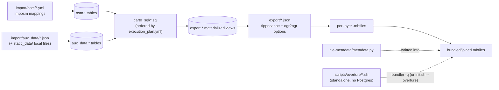

# Schema Reference

`rbt-schema` is the schema/config half of the ABT monorepo. It contains **no
executable pipeline code of its own** (a couple of standalone shell scripts
under `scripts/overture/` aside) — every file described in this section is
read by the [`abtv2-tools`](../overview/architecture.md) CLI, `abt-tools.py`,
which is pointed at this directory via `--schema-dir`. This section documents
the file formats it contains and how to extend them. For the pipeline stages
that actually consume these files, see [Pipeline Stages](../pipeline/download.md)
and the [Pipeline Overview](../overview/pipeline.md).

## Layout

| Directory | Contents |
|---|---|
| `import/osm/` | imposm3 mapping YAML — one file per OSM-derived table |
| `import/aux_data/` | Non-OSM source configs (download URL/local file, format, layers to load) |
| `static_data/` | Raw data files checked into git, referenced by `import/aux_data/*.json` via `local_path` |
| `carto_sql/` | SQL transform scripts that turn `osm.*`/`aux_data.*` into `export.*` materialized views |
| `export/` | Per-layer tippecanoe/ogr2ogr export configs, one JSON file per tile layer |
| `tile-metadata/` | `metadata.py` — descriptive metadata written into the final bundled mbtiles |
| `scripts/overture/` | Standalone Overture buildings pipeline; bypasses `abt-tools.py`/Postgres entirely |

!!! note "Required vs. conventional directories"
    `import/`, `import/osm/`, `import/aux_data/`, `export/`, and `carto_sql/`
    are required — `DataSchema` (`abtv2-tools/abt/schema.py`) validates their
    existence before anything runs:

    ```python
    required_subdirectories = [
        self.base_schema_dir / "import",
        self.base_schema_dir / "import" / "osm",
        self.base_schema_dir / "import" / "aux_data",
        self.base_schema_dir / "export",
        self.base_schema_dir / "carto_sql"
    ]
    missing = [str(d) for d in required_subdirectories if not d.exists()]
    if missing:
        error_string = f"The following directories are missing: {', '.join(missing)}"
        raise ValueError(f"Data schema directories are invalid.\n{error_string}\n{DataSchemaErrorMessage}")
    ```

    `static_data/`, `tile-metadata/`, and `scripts/` are conventions this
    particular schema uses, not things the CLI enforces —
    `tile-metadata/metadata.py` is required in practice, though: the
    [Bundler stage](../pipeline/bundler.md) fails without it.

## Data flow



!!! warning "The dotted arrows aren't run by `abt-tools.py` automatically"
    - `tile-metadata/metadata.py` is loaded and written in by the
      [Bundler stage](../pipeline/bundler.md) itself — it isn't a pipeline
      stage of its own.
    - `scripts/overture/` isn't invoked by `abt-tools.py` at all. Its output
      gets folded into the bundle later via `bundler`'s
      `-q/--additional-mbtiles` flag, either by hand or automatically via
      [`init.sh --overture`](../walkthroughs/init-sh.md). See
      [Overture Buildings](../pipeline/overture.md) for details.

## See also

- [OSM Mappings](osm-mappings.md) — `import/osm/`
- [Auxiliary Data](aux-data.md) — `import/aux_data/` and top-level `static_data/`
- [Carto SQL](carto-sql.md) — `carto_sql/`
- [Layer Registry](layers.md) — `export/`
- [Tile Metadata](tile-metadata.md) — `tile-metadata/metadata.py`
- [Adding a Layer](adding-a-layer.md) — end-to-end workflow, plus the `.skip` convention
