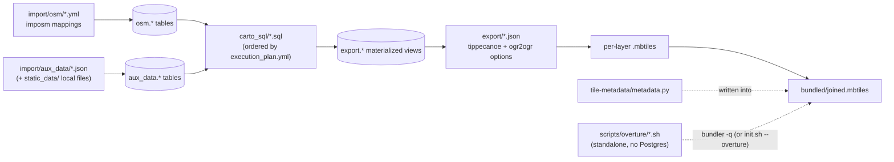

# rbt-schema

The schema/config half of the ABT monorepo: imposm mappings, auxiliary-data
source configs, the `carto_sql` SQL transform layer, per-layer tile export
configs, and bundle metadata for the Releasable Basemap Tiles (RBT)
vector tileset. It contains **no executable pipeline code** of its own (a
couple of standalone shell scripts aside) — everything here is read by the
[`abtv2-tools`](../abtv2-tools/) CLI (`abt-tools.py`), passed in as
`--schema-dir`. Neither half is useful alone: this directory defines *what*
dataset gets built; `abtv2-tools` is the generic engine that builds it. See
the [workspace `README.md`](../README.md) for the end-to-end pipeline
overview and a full worked example, and
[`abtv2-tools/README.md`](../abtv2-tools/README.md) for the CLI/flag
reference. This document covers only what lives in *this* directory: the
file formats it contains and how to extend them.

## Layout

```
import/osm/        imposm3 mapping YAML — one file per OSM-derived table
import/aux_data/   Non-OSM source configs (download URL/local file, format, layers to load)
static_data/       Raw data files checked into git, referenced by import/aux_data/*.json via local_path
carto_sql/         SQL transform scripts that turn osm.*/aux_data.* into export.* materialized views
export/            Per-layer tippecanoe/ogr2ogr export configs, one JSON file per tile layer
tile-metadata/     metadata.py — descriptive metadata written into the final bundled mbtiles
scripts/overture/  Standalone Overture buildings pipeline; bypasses abt-tools.py/Postgres entirely
```

`import/`, `import/osm/`, `import/aux_data/`, `export/`, and `carto_sql/` are
required — [`DataSchema`](../abtv2-tools/abt/schema.py) validates their
existence before anything runs:

```129:140:../abtv2-tools/abt/schema.py
        required_subdirectories = [
            self.base_schema_dir / "import",
            self.base_schema_dir / "import" / "osm",
            self.base_schema_dir / "import" / "aux_data",
            self.base_schema_dir / "export",
            self.base_schema_dir / "carto_sql"
        ]
        missing = [str(d) for d in required_subdirectories if not d.exists()]
        if missing:
            error_string = f"The following directories are missing: {', '.join(missing)}"
            raise ValueError(f"Data schema directories are invalid.\n{error_string}\n{DataSchemaErrorMessage}")
        return self
```

`static_data/`, `tile-metadata/`, and `scripts/` are conventions this
particular schema uses, not things the CLI enforces (`tile-metadata/metadata.py`
is required in practice, though — `bundler` fails without it).

## Data flow



The two dotted arrows are not run by `abt-tools.py` automatically:
`tile-metadata/metadata.py` is loaded and written in by `bundler` itself
(not a pipeline stage of its own), and `scripts/overture/` isn't invoked by
`abt-tools.py` at all — its output gets folded into the same bundle later via
`bundler`'s `-q/--additional-mbtiles` flag, either by hand or automatically
via `init.sh --overture`. See "`scripts/overture/` — standalone Overture
buildings pipeline" below.

## `import/osm/` — imposm mappings

38 [imposm3 mapping](https://imposm.org/docs/imposm3/latest/mapping.html)
fragments, one per output table. The filename (minus extension) doubles as
the YAML's top-level key and the imposm table name; `abt-tools.py` combines
every file here into one mapping and imports OSM data into schema `osm`
(imposm's own default `osm_` table prefix means `water_polygon.yml` becomes
`osm.osm_water_polygon`):

```1:47:import/osm/water_polygon.yml
  water_polygon:
    type: polygon
    columns:
    - name: osm_id
      type: id
    - name: geometry
      type: validated_geometry
    - name: name
      key: name
      type: string
    - name: name_en
      key: name:en
      type: string
    - name: class
      type: mapping_key
    - name: subclass
      type: mapping_value
    - name: intermittent
      key: intermittent
      type: bool
    - name: area
      type: area
    - name: tags
      type: hstore_tags
    filters:
      reject:
        covered:
        - "yes"
    mapping:
      landuse:
      - reservoir
      - basin
      - salt_pond
      leisure:
      - swimming_pool
      natural:
      - water
      - bay
      - spring
      - strait
      waterway:
      - __any__
      water:
      - __any__
      place:
      - sea
      - ocean
```

Every mapping needs `type` (`point`/`linestring`/`polygon`), `columns`, and
`mapping` — [`ImposmMappingFile`](../abtv2-tools/abt/osm_data_model.py) raises
if any is missing. Column `type` values used across this schema: `id`,
`validated_geometry`/`geometry`, `string`, `bool`, `integer`, `area`,
`direction`, `hstore_tags`, `mapping_key`/`mapping_value` (the OSM tag
key/value that matched under `mapping`), plus relation-only types
(`member_id`, `member_role`, `relation_member`) and `wayzorder`. These are
imposm3's own vocabulary, not something rbt-schema defines — see imposm3's
mapping docs for the full spec. `hstore_tags` requires the `hstore` extension
on the target database (see the workspace README's Ubuntu setup section).

## `import/aux_data/` — auxiliary source configs

23 JSON configs, each describing one non-OSM dataset: where to get it, its
format, and which layer(s) inside it to load into Postgres. Parsed by
[`AuxDataLayer`](../abtv2-tools/abt/aux_data_model.py):

| Field | Required | Notes |
|---|---|---|
| `folder_name` | yes | Local download/extraction folder name |
| `url` | one of `url`/`local_path` | Remote source |
| `local_path` | one of `url`/`local_path` | Path relative to this directory's root (see `static_data/` below) |
| `type` | yes | `gpkg`, `gdb`, `fgb`, `shp`, `csv`, `txt`, or `overture` |
| `zipped` | yes | Whether the source is a zip archive |
| `overture_params` | no | `{theme, type}`, only for `type: overture` — unused in this schema today; see "`scripts/overture/`" below for how Overture data is actually loaded here |
| `aux_load` | yes | List of layers to import from this source |

Each `aux_load` entry becomes one `ogr2ogr` import into
`aux_data.<aux_layer_name>`:

| Key | Required | Notes |
|---|---|---|
| `aux_file_name` | one of `aux_file_name`/`aux_folder_name` | File within the extracted source |
| `aux_folder_name` | one of `aux_file_name`/`aux_folder_name` | Fallback for both `aux_file_name` and `aux_layer_name` when unset |
| `aux_layer_name` | no (falls back to `aux_folder_name`) | Target table name — `aux_data.<aux_layer_name>` |
| `aux_source_name` | no (defaults to `aux_layer_name`) | Layer name *inside* the source file; supports glob patterns for versioned names |
| `aux_load_options` | no | Raw `ogr2ogr` flags, e.g. `-nlt MULTIPOLYGON` |

A single multi-layer remote source (one GeoPackage, several tables loaded
from it):

```1:20:import/aux_data/ne_vector.json
{
    "folder_name": "natural_earth_10m",
    "url": "https://naciscdn.org/naturalearth/packages/natural_earth_vector.gpkg.zip",
    "type": "gpkg",
    "zipped": true,
    "aux_load": [
        {
            "aux_file_name": "natural_earth_vector.gpkg",
            "aux_layer_name": "ne_10m_admin_0_countries",
            "aux_load_options": "-nlt MULTIPOLYGON"
        },
        {
            "aux_file_name": "natural_earth_vector.gpkg",
            "aux_layer_name": "ne_10m_glaciated_areas",
            "aux_load_options": "-nlt MULTIPOLYGON"
        },
        {
            "aux_file_name": "natural_earth_vector.gpkg",
            "aux_layer_name": "ne_10m_geography_regions_polys",
            "aux_load_options": "-nlt MULTIPOLYGON"
        },
```

A glob-matched `aux_source_name`, for a source whose internal layer name is
versioned (`dos_lsib.json`, trimmed):

```1:11:import/aux_data/dos_lsib.json
{
    "folder_name": "dos_lsib",
    "url": "https://data.geodata.state.gov/LSIB.gpkg",
    "type": "gpkg",
    "zipped": false,
    "aux_load": [
        {
            "aux_file_name": "LSIB.gpkg",
            "aux_source_name": "Department of State LSIB*",
            "aux_layer_name": "dos_lsib",
            "aux_load_options": "-nlt MULTILINESTRING"
        }
```

All non-OSM data lands in a single `aux_data` schema (unlike the several
carto-owned staging schemas below) — table names are exactly whatever
`aux_layer_name` (or its `aux_folder_name` fallback) says, so
cross-referencing an aux table from `carto_sql` just means matching that
value against the JSON configs in this directory.

## `static_data/` — bundled local data files

Not to be confused with `carto_sql/static_data/` (next section) — this
top-level directory holds raw data files checked directly into git, for
sources that don't need downloading every run. Referenced via an
`import/aux_data/*.json`'s `local_path`, which resolves relative to this
directory's root:

```1:12:import/aux_data/ne_physical_centerlines.json
{
    "folder_name": "ne_physical_centerlines",
    "local_path": "static_data/ne_physical_centerlines.fgb.zip",
    "type": "fgb",
    "zipped": true,
    "aux_load": [
        {
            "aux_file_name": "ne_physical_centerlines.fgb",
            "aux_layer_name": "ne_physical_centerlines"
        }
    ]
}
```

`local_path` and `url` are mutually exclusive; a `local_path` source skips
the download step entirely but still goes through extraction/import like any
other aux source (`-d aux`/`-d all` during `import`).

## `carto_sql/` — SQL transform layer

33 numbered SQL scripts (plus `099_update_geometry.sql`) that read
`osm.*`/`aux_data.*` and build every `export.*` table — always as a
`CREATE MATERIALIZED VIEW` (this schema has zero plain `CREATE VIEW`
objects under `export`, so every layer's data is materialized at `carto`
time, not read live at export time). Each script follows the same shape:
a header comment naming the layer/schema/sources, then one or more
`BEGIN; DROP ... CASCADE; CREATE MATERIALIZED VIEW ...; CREATE INDEX ...; COMMIT;`
blocks. Numeric filename prefixes control ordering; the sequence has gaps
(no `002` or `016`, and `031` only exists as `.skip`'d — see below), which
is fine — nothing requires the numbers to be contiguous, so there's no need
to renumber every later script just to close a gap left by a removed or
disabled one.

**Scripts must be safe to re-run.** `carto` always redoes the full stage
from scratch (unlike `download`/`export`, which skip existing output) — the
`DROP ... IF EXISTS ... CASCADE` at the top of every block is what makes
that safe.

**`000_update_aux_geom.sql`/`001_set_schema.sql` (prefix) and
`099_update_geometry.sql`(suffix)** always run first/last, sequentially.
The prefix normalizes every `aux_data.*` table's geometry column (renames
to `geometry`, reprojects 3857→4326, indexes) before anything reads it, and
(re)creates the `export` schema; the suffix does the same normalization pass
over `export.*` once every layer has been built:

```1:18:carto_sql/001_set_schema.sql
-- =============================================================================
-- SCHEMA SETUP
-- Schema:        export
-- =============================================================================


-- -----------------------------------------------------------------------------
-- osm.ZRes — tile resolution in map units per pixel at zoom level z
-- -----------------------------------------------------------------------------

BEGIN;
CREATE OR REPLACE FUNCTION public.ZRes(z integer)
RETURNS float
LANGUAGE SQL IMMUTABLE STRICT PARALLEL SAFE
AS $func$
SELECT (40075016.6855785 / (256 * 2^z));
$func$;
COMMIT;
```

**`execution_plan.yml`** declares which of the remaining scripts can run
concurrently against Postgres (read by `abt-tools.py carto`'s
`-n/--carto-concurrency`; falls back to strict filename order if this file
is absent) — 29 groups today, all independent except one real dependency:

```45:55:carto_sql/execution_plan.yml
groups:
  # 005b reads water.classify_water_type(), a function created by 005a --
  # a real execution-order dependency, not just a shared schema name.
  - [005a_water_polygon.sql, 005b_water_line.sql]

  # Everything else only ever shared a *schema name* with another script
  # (e.g. 004_railway.sql creates transportation.railway_normalized, but
  # never reads 003_road.sql's transportation.usa_boundary) -- now that
  # custom_schemas above are created up front, each of these is independent.
  - [003_road.sql]
  - [004_railway.sql]
```

It also lists every custom schema (`water`, `transportation`, `landuse`,
`landcover`, `infrastructure`, `aeroway`, `dam`, `poi`) and extension
(`dblink`) these scripts create, so they can be created once up front
instead of racing across concurrent sessions the first time. **Update this
file whenever you add, remove, or re-scope a script** — its own header
documents exactly how:

```86:97:carto_sql/execution_plan.yml
# How to update this file when carto_sql changes:
#   1. New script with no custom schema, reading only osm.*/aux_data.* and
#      writing its own export.* tables: add it as its own single-item group.
#   2. New script that creates a *new* custom schema: add the schema name to
#      custom_schemas, add the script as its own group.
#   3. New script that reads/writes a table (not just a schema name) created
#      by another script: add it to that script's group, after it, in the
#      same inner list.
#   4. Deleted/renamed script: remove/update its entry above.
#   5. When in doubt, add it as a new single-item group and grep the rest of
#      carto_sql for its schema/table names to confirm nothing else depends
#      on it.
```

`execution_plan.yml` is validated against the actual `*.sql` files present
before any run starts — a script on disk but missing from the plan, a plan
entry with no matching file, or a duplicate both fail fast rather than
silently building an incomplete tileset.

**`carto_sql` can produce more `export.*` views than are actually tiled.**
`025_sports.sql` builds `export.golf_course` and `export.sports_ground`, but
neither has a matching `export/*.json` — every one of the 58 files in
`export/` does have a matching `CREATE MATERIALIZED VIEW export.<layer_id>`
somewhere in `carto_sql`, but the reverse isn't guaranteed. The binding is
purely by naming convention (`export/<layer_id>.json` ↔
`export.<layer_id>`) — nothing enforces it, so a typo in either place just
makes a layer silently fail to export/tile rather than raising an error.

**`carto_sql/static_data/`** is a second, unrelated "static data" concept
from the top-level `static_data/` directory above: standalone SQL that seeds
a table directly via plain `INSERT` statements, entirely bypassing
download/extract/`ogr2ogr`. Because `carto`'s script discovery
([`carto_sql_layers`](../abtv2-tools/abt/schema.py)) globs `carto_sql/*.sql`
non-recursively, nothing in this subfolder ever runs automatically — it's a
manual, dependency-free alternative for seeding `aux_data.ne_physical_centerlines`
(the same table `import/aux_data/ne_physical_centerlines.json` populates
through the ordinary pipeline) with plain `psql`, useful if you want that one
table without running `import` at all:

```1:12:carto_sql/static_data/ne_physical_centerlines.sql
-- =============================================================================
-- STATIC DATA: Natural Earth Physical Centerlines
-- Schema:  aux_data
-- Source:  Natural Earth ne_10m_rivers_lake_centerlines (static, bundled)
-- Notes:   460 features. scalerank/min_label/max_label carry NE cartographic
--          priority signals for river/drainage label visibility. Loaded once —
--          this dataset does not change between pipeline runs.
-- =============================================================================

BEGIN;
DROP TABLE IF EXISTS aux_data.ne_physical_centerlines CASCADE;
CREATE TABLE aux_data.ne_physical_centerlines (
```

## `export/` — tile layer definitions

58 JSON configs (one per output vector tile layer), each read by
[`TileLayer`](../abtv2-tools/abt/export/tile_layer_model.py) to build the
`ogr2ogr` (PostGIS → FlatGeobuf) and `tippecanoe` (FlatGeobuf → MBTiles)
commands for that layer:

| Field | Notes |
|---|---|
| `layer_id` | Must match an `export.<layer_id>` materialized view from `carto_sql` |
| `geometry_type` | `polygon`, `linestring`, or `point` |
| `attributes` | `[{name, type, description}]`; `type` is `string`, `float`, `int`, or `bool`. Omit entirely (`[]`) to export geometry only (`-X`, no attributes at all) |
| `source_attribution` | Free text |
| `tippecanoe_options` | `minimum_zoom`, `maximum_zoom` (capped to whichever `-z/--max-zoom` the `export` command itself was run with — defaults to 13, hard-capped at 15), `additional_flags` (raw tippecanoe flags), `filter` (a [tippecanoe `-j`](https://github.com/felt/tippecanoe#filtering-features-by-attributes) JSON expression) |
| `ogr_export_options` | `additional_flags` (raw `ogr2ogr` flags, e.g. `-nlt PROMOTE_TO_MULTI`) |

A zoom-dependent filter, dropping features by `z_level` at low zooms so
overlapping water polygons don't all render at once (`water_polygon.json`,
trimmed):

```10:28:export/water_polygon.json
    "tippecanoe_options": {
        "minimum_zoom": 0,
        "maximum_zoom": 13,
        "additional_flags": "--simplify-only-low-zooms --no-tiny-polygon-reduction-at-maximum-zoom --hilbert --coalesce --detect-longitude-wraparound",
        "filter": {
            "*": [
                "any",
                ["all", [">=", "$zoom", 0], ["<=", "$zoom", 4], ["==", "z_level", 1]],
                ["all", [">=", "$zoom", 5],  ["==", "z_level", 5]],
                ["all", [">=", "$zoom", 6],  ["==", "z_level", 6]],
                ["all", [">=", "$zoom", 7],  ["==", "z_level", 7]],
                ["all", [">=", "$zoom", 8],  ["==", "z_level", 8]],
                ["all", [">=", "$zoom", 9],  ["==", "z_level", 9]],
                ["all", [">=", "$zoom", 10], ["==", "z_level", 10]],
                ["all", [">=", "$zoom", 11], ["==", "z_level", 11]],
                ["all", [">=", "$zoom", 12], ["==", "z_level", 12]]
            ]
        }
    },
```

## `tile-metadata/metadata.py`

A plain Python module (not JSON — it's imported directly), read once by
`bundler` and written into the joined `mbtiles`' `metadata` table:

```22:29:../abtv2-tools/abt/cli_funcs/bundler.py
def _load_metadata(schema_dir: Path) -> dict:
    metadata_path = schema_dir / "tile-metadata" / "metadata.py"
    if not metadata_path.exists():
        raise FileNotFoundError(f"No metadata.py found at {metadata_path}")
    spec = importlib.util.spec_from_file_location("tile_metadata", metadata_path)
    mod = importlib.util.module_from_spec(spec)
    spec.loader.exec_module(mod)
    return mod.metadata
```

It must define a module-level `metadata` dict — this schema's includes
`name`, `version`, a computed `production_date` (UTC, at load time),
`attribution` (HTML), `tags`, `license` (a list of `{name, license, url}`),
`creators`, `bounds`, and `center`. `bounds`/`center`/`format` are
overwritten by `bundler` regardless of what's here — those three are
computed from the actual joined tiles, not user-configurable.

## `scripts/overture/` — standalone Overture buildings pipeline

Three shell scripts that build the `building_polygon` layer from
[Overture Maps](https://overturemaps.org) building footprints, entirely
outside `abt-tools.py`/Postgres — DuckDB reads Overture's GeoParquet
directly from S3, shards it to per-file FlatGeobuf, and tippecanoe tiles it
straight to `.mbtiles` (a reprojected build gets the same extension; see below):

```bash
./fetch.sh /path/to/data_dir [jobs] [shard_threads]
./tile.sh /path/to/data_dir
# -> data_dir/building_polygon_3857.mbtiles
```

(See [`scripts/overture/README.md`](scripts/overture/README.md) for the
EPSG:3395/4087 reprojected variants — and `SRS_LIST`, which drives several
projections from one `fetch.sh` call — which reproject before tiling and tell
tippecanoe it's already receiving 3857 so it doesn't reproject a second time.)

This is why the OSM-derived building layer is disabled (see "The `.skip`
convention" below): buildings come from here instead. The resulting
`building_polygon_*` files aren't picked up by `abt-tools.py`
automatically — fold each into its matching projection's tileset by passing
it to that `bundler` run's `-q/--additional-mbtiles`:

```bash
python abt-tools.py bundler -w <working_dir> -s ../rbt-schema -p env \
  -q /path/to/data_dir/building_polygon_3857.mbtiles
```

or run [`init.sh --overture`](../init.sh), which fetches/tiles Overture
buildings in the background alongside the rest of the pipeline and passes
each projection's output to its matching bundler run automatically. Add
`--overture-clean` to also delete each projection's FlatGeobuf shards as it
finishes tiling — at planet scale those shards dominate the pipeline's disk
use, at the cost of re-sharding on a later re-run.

`init.sh` defaults to building 3857, 3395, and 4087; pass
`--projections "<space-separated EPSG codes>"` to build a different set
(each non-3857 entry needs metres-based units, the same requirement
`--projection-override` already has). `--contours <dir>` folds externally-
produced `contours_<srs>.mbtiles` files from that directory into each
projection's bundle the same way `-q` folds in Overture buildings — `init.sh`
CRS-tags a reprojected contours file in place (reusing Overture's own
`tag_crs.py`) if it doesn't already carry a `crs` row, and aborts up front if
a file is missing or already tagged with a different projection than
requested.

`shard.sh` skips any output file that already exists and `fetch.sh`'s S3
download is an `aws s3 sync`, so the whole pipeline is safe to re-run after
an interruption. `SRS_LIST`/`OVERTURE_RELEASE` (on `fetch.sh`) and
`SHARD_THREADS`/`TARGET_SRS` (on `shard.sh`) env vars control which
projections get sharded, which Overture release to use, per-shard DuckDB
threading, and reprojection to any other projected EPSG code (e.g. 3395,
4087) — see the script's own README for the mechanics.

`init.sh --from export` skips `[1/6]`-`[3/6]` (download/import/carto) and
jumps straight to `[4/6]`, once a preflight confirms with `ogrinfo` that
every projection's workspace already has a complete, readable `.fgb` for
each export layer. It aborts up front — before touching Postgres or
launching `--overture`'s background pipeline — if any `.fgb` is missing or
unreadable. Combined with `--overture`, it also skips re-launching the
fetch+tile pipeline whenever every projection's `building_polygon_<srs>`
output already exists, folding that existing file into the bundle exactly
as a fresh run would.

## The `.skip` convention

Appending `.skip` to a `carto_sql/*.sql` or `export/*.json` filename removes
it from `abt-tools.py`'s glob (`*.sql`/`*.json`) without deleting the file —
useful for disabling a layer while keeping its SQL/config around for
reference or future re-enabling. Currently used for exactly this reason:
`carto_sql/031_building.sql.skip` and `export/building_polygon.json.skip`
disable the OSM-derived `building_polygon` layer in favor of the Overture
pipeline above. `execution_plan.yml` validation treats a `.skip`'d script the
same as a deleted one — it must not appear in the plan either.

## Adding or changing a layer

**New OSM-derived layer:**
1. Add `import/osm/<table>.yml` (imposm mapping).
2. Add a numbered `carto_sql/NNN_<name>.sql` reading `osm.osm_<table>`,
   producing `export.<layer_id>` as a materialized view with a `gist` index
   on `geometry`.
3. Add it to `carto_sql/execution_plan.yml` (own group, unless it shares a
   table with another script — see the file's own "How to update" guidance
   above).
4. Add `export/<layer_id>.json` with matching `layer_id`.

**New aux-data-derived layer:** same, but add `import/aux_data/<name>.json`
instead of an imposm mapping, and reference `aux_data.<aux_layer_name>` from
your `carto_sql` script.

**Changing only how a layer tiles** (zoom range, attributes, filter):
edit its `export/<layer_id>.json` only — no `carto_sql` or database change
needed, since `export` reads straight from the already-built
`export.<layer_id>` view.

**Disabling a layer:** rename its `carto_sql/*.sql` and/or `export/*.json`
to add a trailing `.skip`, and remove it from `execution_plan.yml` if
present.

Validate any change with a small extract rather than a full planet
build — see the workspace README's
[small extract walkthrough](../README.md#6-small-extract-walkthrough-norway) for a complete,
copy-pasteable `download`/`import`/`carto`/`export` sequence, and
`abt-tools.py debug_aux_import` to test one `import/aux_data/*.json` file in
isolation.

## Attribution & licensing

Per `tile-metadata/metadata.py`, this tileset combines:

| Source | License |
|---|---|
| [OpenStreetMap](https://www.openstreetmap.org/copyright) | ODbL 1.0 |
| [FieldMaps](https://fieldmaps.io/data/) | ODbL 1.0 |
| [Overture Maps Foundation](https://overturemaps.org/resources/license/) | ODbL 1.0 |
| [Natural Earth](https://www.naturalearthdata.com/about/terms-of-use/) | Public Domain |
| [OurAirports](https://ourairports.com/about.html) | Public Domain |

Plus data from the National Geospatial-Intelligence Agency (NGA GeoNames),
USGS (Domestic Names), and the US Dept. of State (LSIB) — see
`tile-metadata/metadata.py` for the full attribution string.

## See also

- [Workspace `README.md`](../README.md) — pipeline overview, Ubuntu setup, planet + small-extract walkthroughs, troubleshooting.
- [`abtv2-tools/README.md`](../abtv2-tools/README.md) — CLI command/flag reference, sizing, carto concurrency internals.
